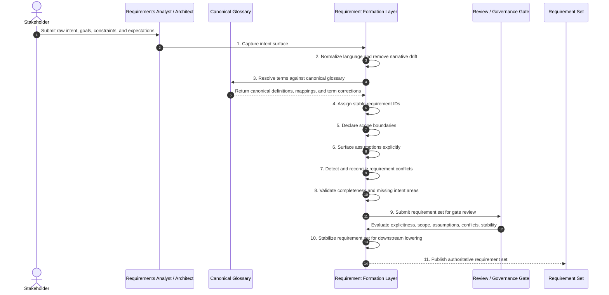

# Phase 01 — Requirement Formation

## Overview

This phase establishes the authoritative semantic surface of the system.  
All downstream correctness, closure, and proof depend on the integrity of this layer.

No requirement that fails this phase may proceed.

---

## Objective

Transform raw intent into structured, explicit, glossary-grounded, and addressable requirements suitable for invariant extraction.

---

## Inputs

- Raw stakeholder intent
- Domain knowledge
- Existing system context (optional)
- Canonical glossary (initial or evolving)

---

## Outputs

- Normalized requirement set
- Requirement IDs
- Explicit assumptions
- Declared scope boundaries
- Conflict resolution artifacts

---

## Mermaid Sequence Diagram

---

## Step Summary Table

| Owner | # | Step | What is happening |
|:---:|---:|---|---|
| 🟦 | 1 | Capture intent surface | Raw stakeholder intent is collected without transformation to preserve full semantic signal. |
| 🟥 | 2 | Normalize language | Ambiguity and narrative phrasing are removed to create structured statements. |
| 🟥 | 3 | Resolve terms against glossary | All terms are aligned to canonical definitions to eliminate semantic drift. |
| 🟥 | 4 | Assign requirement IDs | Each requirement becomes addressable and traceable. |
| 🟥 | 5 | Declare scope boundaries | Defines what is in and out of system scope. |
| 🟥 | 6 | Surface assumptions | Hidden meaning is made explicit. |
| 🟥 | 7 | Detect conflicts | Contradictions are resolved before propagation. |
| 🟥 | 8 | Validate completeness | Missing intent and gaps are identified. |
| 🟦 | 9 | Governance review | Ensures readiness and enforcement. |
| 🟥 | 10 | Stabilize requirements | Freezes requirement set for downstream use. |
| 🟦 | 11 | Publish requirements | Produces authoritative input for invariant extraction. |

---

## Step Sequence

### 🟦 STEP 01 — Capture Intent Surface  
**Tagline:** Bring all intended behavior into visibility  

**Actions**

* **🟥 AI Actions:** Analyze supporting artifacts for Capture Intent Surface, update structured outputs, and surface gaps.
* **🟦 Human Actions:** Review Capture Intent Surface outputs, resolve domain decisions, and approve the outcome.

**Description:**  
Collect all raw intent from stakeholders, documents, or systems.

**Inputs:** Stakeholder input, documentation  
**Outputs:** Raw requirement set  

**Associated Invariants:**  
CDD_REQUIREMENT_SOURCE_AUTHORITY, CDD_REQUIREMENT_COMPLETENESS_PRESSURE  

---

### 🟥 STEP 02 — Normalize Language  
**Tagline:** Remove ambiguity and narrative drift  

**Actions**

* **🟥 AI Actions:** Analyze supporting artifacts for Normalize Language, update structured outputs, and surface gaps.
* **🟦 Human Actions:** Review Normalize Language outputs, resolve domain decisions, and approve the outcome.

**Description:**  
Rewrite requirements into clear, structured statements.

**Inputs:** Raw requirements  
**Outputs:** Normalized requirements  

**Associated Invariants:**  
CDD_REQUIREMENT_EXPLICITNESS, CDD_REQUIREMENT_NORMALIZABILITY  

---

### 🟥 STEP 03 — Apply Glossary Grounding  
**Tagline:** Anchor meaning to canonical terms  

**Actions**

* **🟥 AI Actions:** Analyze supporting artifacts for Apply Glossary Grounding, update structured outputs, and surface gaps.
* **🟦 Human Actions:** Review Apply Glossary Grounding outputs, resolve domain decisions, and approve the outcome.

**Description:**  
Align all terms to glossary definitions.

**Inputs:** Requirements, glossary  
**Outputs:** Glossary-aligned requirements  

**Associated Invariants:**  
CDD_GLOSSARY_CANONICAL_VOCABULARY, CDD_GLOSSARY_UNDEFINED_TERM_PROHIBITION  

---

### 🟥 STEP 04 — Assign Requirement IDs  
**Tagline:** Make intent addressable  

**Actions**

* **🟥 AI Actions:** Analyze supporting artifacts for Assign Requirement IDs, update structured outputs, and surface gaps.
* **🟦 Human Actions:** Review Assign Requirement IDs outputs, resolve domain decisions, and approve the outcome.

**Description:**  
Assign stable identifiers.

**Inputs:** Requirements  
**Outputs:** ID-tagged requirements  

**Associated Invariants:**  
CDD_REQUIREMENT_ADDRESSABILITY, CDD_TRACEABILITY_STABLE_IDS  

---

### 🟥 STEP 05 — Declare Scope Boundaries  
**Tagline:** Define system limits  

**Actions**

* **🟥 AI Actions:** Analyze supporting artifacts for Declare Scope Boundaries, update structured outputs, and surface gaps.
* **🟦 Human Actions:** Review Declare Scope Boundaries outputs, resolve domain decisions, and approve the outcome.

**Description:**  
Explicitly define inclusion and exclusion scope.

**Associated Invariants:**  
CDD_REQUIREMENT_SCOPE_BOUNDARY  

---

### 🟥 STEP 06 — Surface Assumptions  
**Tagline:** Make implicit meaning explicit  

**Actions**

* **🟥 AI Actions:** Analyze supporting artifacts for Surface Assumptions, update structured outputs, and surface gaps.
* **🟦 Human Actions:** Review Surface Assumptions outputs, resolve domain decisions, and approve the outcome.

**Description:**  
Document hidden assumptions.

**Associated Invariants:**  
CDD_REQUIREMENT_ASSUMPTION_VISIBILITY  

---

### 🟥 STEP 07 — Detect Conflicts  
**Tagline:** Eliminate contradictions  

**Actions**

* **🟥 AI Actions:** Analyze supporting artifacts for Detect Conflicts, update structured outputs, and surface gaps.
* **🟦 Human Actions:** Review Detect Conflicts outputs, resolve domain decisions, and approve the outcome.

**Description:**  
Resolve conflicting requirements.

**Associated Invariants:**  
CDD_REQUIREMENT_CONFLICT_RESOLUTION  

---

### 🟥 STEP 08 — Validate Completeness  
**Tagline:** Ensure full intent coverage  

**Actions**

* **🟥 AI Actions:** Analyze supporting artifacts for Validate Completeness, update structured outputs, and surface gaps.
* **🟦 Human Actions:** Review Validate Completeness outputs, resolve domain decisions, and approve the outcome.

**Description:**  
Identify missing or underdefined behavior.

**Associated Invariants:**  
CDD_REQUIREMENT_COMPLETENESS_PRESSURE  

---

### 🟦 STEP 09 — Governance Review  
**Tagline:** Enforce readiness  

**Actions**

* **🟥 AI Actions:** Analyze supporting artifacts for Governance Review, update structured outputs, and surface gaps.
* **🟦 Human Actions:** Review Governance Review outputs, resolve domain decisions, and approve the outcome.

**Description:**  
Validate quality gates before proceeding.

**Associated Invariants:**  
CDD_GOVERNANCE_ENTRY_EXIT_GATES  

---

### 🟥 STEP 10 — Stabilize Requirements  
**Tagline:** Freeze semantic baseline  

**Actions**

* **🟥 AI Actions:** Analyze supporting artifacts for Stabilize Requirements, update structured outputs, and surface gaps.
* **🟦 Human Actions:** Review Stabilize Requirements outputs, resolve domain decisions, and approve the outcome.

**Description:**  
Prepare requirements for invariant extraction.

**Associated Invariants:**  
CDD_REQUIREMENT_STABILITY_GATE  

---

### 🟦 STEP 11 — Publish Requirements  
**Tagline:** Establish authoritative source  

**Actions**

* **🟥 AI Actions:** Analyze supporting artifacts for Publish Requirements, update structured outputs, and surface gaps.
* **🟦 Human Actions:** Review Publish Requirements outputs, resolve domain decisions, and approve the outcome.

**Description:**  
Produce final requirement set.

**Associated Invariants:**  
CDD_FOUNDATION_INTENT_PRECEDENCE  

---

## Exit Criteria

- Requirements are explicit, normalized, glossary-aligned  
- Stable IDs assigned  
- No conflicts  
- Assumptions visible  
- Scope defined  
- Ready for invariant extraction  

---

## Final Compression

This phase transforms undefined intent into a bounded, addressable semantic surface upon which all downstream truth depends.

