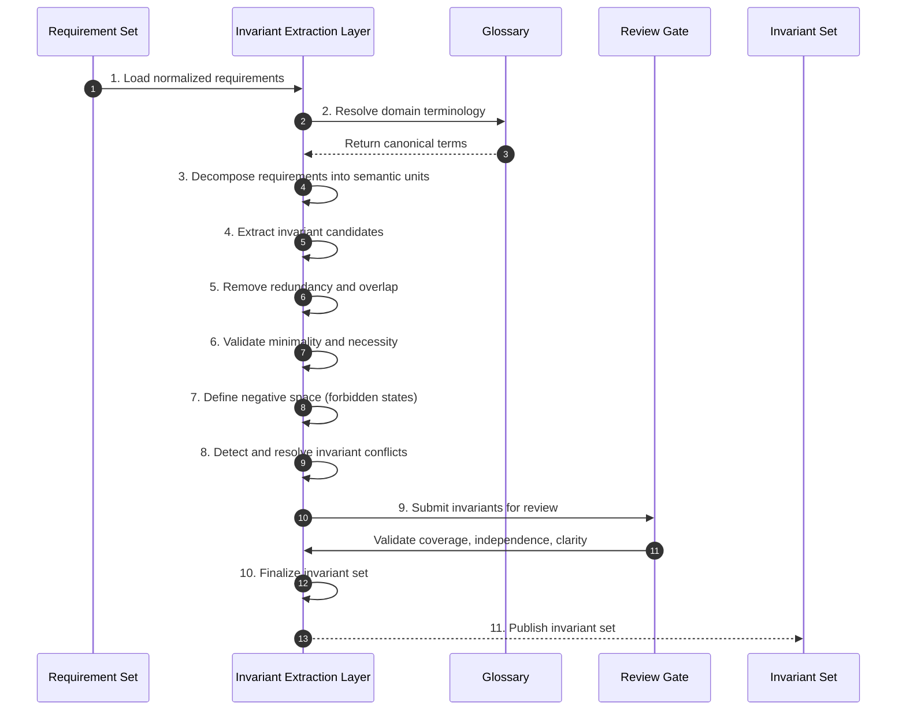

# Phase 02 — Invariant Extraction

## Overview

This phase converts structured requirements into irreducible semantic truths (invariants).  
It is the compression layer where intent becomes governable.

No invariant set that fails this phase may proceed.

---

## Objective

Transform normalized requirements into minimal, non-redundant, implementation-independent invariants that fully preserve intent.

---

## Inputs

- Stable requirement set (Phase 01 output)
- Canonical glossary

---

## Outputs

- Invariant set
- Invariant-to-requirement mappings
- Conflict resolution artifacts
- Negative-space definitions

## Phase Artifacts

- [Phase 2 Invariants](./Invariants.md)

---

## Mermaid Sequence Diagram

---

## Step Summary Table

| Owner | # | Step | What is happening |
|:---:|---:|---|---|
| 🟥 | 1 | Load requirements | Bring in stable, normalized requirements from Phase 01 |
| 🟥 | 2 | Resolve terminology | Ensure all semantics align with glossary |
| 🟥 | 3 | Decompose requirements | Break into atomic semantic units |
| 🟥 | 4 | Extract invariants | Convert units into irreducible truths |
| 🟥 | 5 | Remove redundancy | Eliminate duplicate or overlapping invariants |
| 🟥 | 6 | Validate minimality | Ensure each invariant is necessary and sufficient |
| 🟥 | 7 | Define negative space | Capture forbidden or invalid states |
| 🟥 | 8 | Resolve conflicts | Eliminate contradictions |
| 🟦 | 9 | Review gate | Validate completeness and correctness |
| 🟥 | 10 | Finalize invariants | Lock invariant set |
| 🟦 | 11 | Publish invariants | Output authoritative invariant layer |

---

## Step Sequence

### 🟥 STEP 01 — Load Requirements  
**Tagline:** Establish semantic input  

**Actions**

* **🟥 AI Actions:** Analyze supporting artifacts for Load Requirements, update structured outputs, and surface gaps.
* **🟦 Human Actions:** Review Load Requirements outputs, resolve domain decisions, and approve the outcome.

**Description:**  
Load stable requirements from Phase 01.

**Associated Invariants:**  
CDD_TRACEABILITY_REQUIREMENT_TO_INVARIANT  

---

### 🟥 STEP 02 — Resolve Terminology  
**Tagline:** Align semantic language  

**Actions**

* **🟥 AI Actions:** Analyze supporting artifacts for Resolve Terminology, update structured outputs, and surface gaps.
* **🟦 Human Actions:** Review Resolve Terminology outputs, resolve domain decisions, and approve the outcome.

**Description:**  
Ensure all terms match glossary definitions.

**Associated Invariants:**  
CDD_GLOSSARY_CANONICAL_VOCABULARY  

---

### 🟥 STEP 03 — Decompose Requirements  
**Tagline:** Break intent into atomic meaning  

**Actions**

* **🟥 AI Actions:** Analyze supporting artifacts for Decompose Requirements, update structured outputs, and surface gaps.
* **🟦 Human Actions:** Review Decompose Requirements outputs, resolve domain decisions, and approve the outcome.

**Description:**  
Split requirements into smallest meaningful units.

**Associated Invariants:**  
CDD_REQUIREMENT_GRANULARITY_FIT  

---

### 🟥 STEP 04 — Extract Invariants  
**Tagline:** Capture irreducible truths  

**Actions**

* **🟥 AI Actions:** Analyze supporting artifacts for Extract Invariants, update structured outputs, and surface gaps.
* **🟦 Human Actions:** Review Extract Invariants outputs, resolve domain decisions, and approve the outcome.

**Description:**  
Transform semantic units into invariant statements.

**Associated Invariants:**  
CDD_INVARIANT_IRREDUCIBLE_TRUTH, CDD_INVARIANT_DERIVATION_REQUIRED  

---

### 🟥 STEP 05 — Remove Redundancy  
**Tagline:** Eliminate duplication  

**Actions**

* **🟥 AI Actions:** Analyze supporting artifacts for Remove Redundancy, update structured outputs, and surface gaps.
* **🟦 Human Actions:** Review Remove Redundancy outputs, resolve domain decisions, and approve the outcome.

**Description:**  
Merge or remove overlapping invariants.

**Associated Invariants:**  
CDD_INVARIANT_NON_REDUNDANCY  

---

### 🟥 STEP 06 — Validate Minimality  
**Tagline:** Ensure necessity  

**Actions**

* **🟥 AI Actions:** Analyze supporting artifacts for Validate Minimality, update structured outputs, and surface gaps.
* **🟦 Human Actions:** Review Validate Minimality outputs, resolve domain decisions, and approve the outcome.

**Description:**  
Each invariant must be essential and minimal.

**Associated Invariants:**  
CDD_INVARIANT_MINIMALITY, CDD_INVARIANT_NECESSITY  

---

### 🟥 STEP 07 — Define Negative Space  
**Tagline:** Capture what must not exist  

**Actions**

* **🟥 AI Actions:** Analyze supporting artifacts for Define Negative Space, update structured outputs, and surface gaps.
* **🟦 Human Actions:** Review Define Negative Space outputs, resolve domain decisions, and approve the outcome.

**Description:**  
Explicitly define forbidden states.

**Associated Invariants:**  
CDD_INVARIANT_NEGATIVE_SPACE  

---

### 🟥 STEP 08 — Resolve Conflicts  
**Tagline:** Remove contradictions  

**Actions**

* **🟥 AI Actions:** Analyze supporting artifacts for Resolve Conflicts, update structured outputs, and surface gaps.
* **🟦 Human Actions:** Review Resolve Conflicts outputs, resolve domain decisions, and approve the outcome.

**Description:**  
Ensure invariants are consistent.

**Associated Invariants:**  
CDD_INVARIANT_CONFLICT_RESOLUTION  

---

### 🟦 STEP 09 — Review Gate  
**Tagline:** Validate integrity  

**Actions**

* **🟥 AI Actions:** Analyze supporting artifacts for Review Gate, update structured outputs, and surface gaps.
* **🟦 Human Actions:** Review Review Gate outputs, resolve domain decisions, and approve the outcome.

**Description:**  
Check coverage and clarity.

**Associated Invariants:**  
CDD_CLOSURE_PARENT_CHILD_COVERAGE  

---

### 🟥 STEP 10 — Finalize Invariants  
**Tagline:** Lock semantic truth  

**Actions**

* **🟥 AI Actions:** Analyze supporting artifacts for Finalize Invariants, update structured outputs, and surface gaps.
* **🟦 Human Actions:** Review Finalize Invariants outputs, resolve domain decisions, and approve the outcome.

**Description:**  
Freeze invariant set.

**Associated Invariants:**  
CDD_CLOSURE_BEFORE_AUTHORITY  

---

### 🟦 STEP 11 — Publish Invariants  
**Tagline:** Enable constraint derivation  

**Actions**

* **🟥 AI Actions:** Analyze supporting artifacts for Publish Invariants, update structured outputs, and surface gaps.
* **🟦 Human Actions:** Review Publish Invariants outputs, resolve domain decisions, and approve the outcome.

**Description:**  
Provide invariant set for next phase.

**Associated Invariants:**  
CDD_TRACEABILITY_INVARIANT_TO_CONSTRAINT  

---

## Exit Criteria

- Invariants are minimal, non-redundant, and complete  
- Fully traceable to requirements  
- No conflicts  
- Negative space defined  
- Ready for constraint derivation  

---

## Final Compression

This phase transforms structured intent into irreducible semantic truth that governs all downstream behavior.

