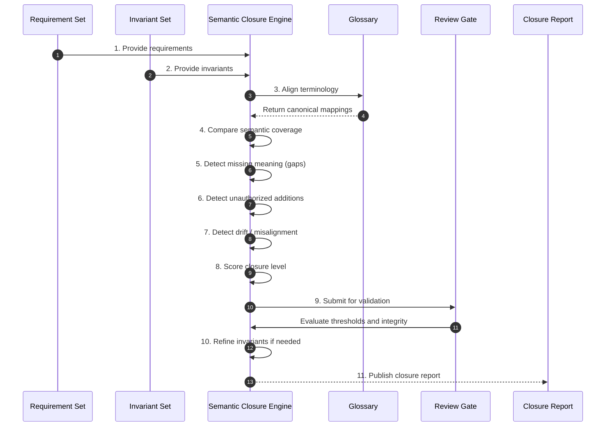

# Phase 03 — Semantic Closure Validation

## Overview

This phase verifies that invariants fully and faithfully represent requirement intent.  
It ensures semantic containment before any executable form (constraints) is created.

No invariant set that fails closure may proceed.

---

## Objective

Measure and enforce semantic closure between requirements and invariants such that no meaning is lost, altered, or invented.

---

## Inputs

- Requirement set (Phase 01)
- Invariant set (Phase 02)
- Canonical glossary

---

## Outputs

- Closure report (coverage, gaps, drift)
- Refined invariant set
- Closure score / threshold validation
- Gap resolution artifacts

## Phase Artifacts

- [Phase 3 Invariants](./Invariants.md)

---

## Mermaid Sequence Diagram

---

## Step Summary Table

| Owner | # | Step | What is happening |
|:---:|---:|---|---|
| 🟥 | 1 | [Provide requirements](./Steps/Step-01/) | Requirements are loaded as the semantic source of truth |
| 🟥 | 2 | [Provide invariants](./Steps/Step-02/) | Invariants are loaded as candidate representations |
| 🟥 | 3 | [Align terminology](./Steps/Step-03/) | Glossary ensures consistent semantic comparison |
| 🟥 | 4 | [Compare coverage](./Steps/Step-04/) | Evaluate how well invariants represent requirements |
| 🟥 | 5 | [Detect gaps](./Steps/Step-05/) | Identify missing intent not captured in invariants |
| 🟥 | 6 | [Detect additions](./Steps/Step-06/) | Identify invented semantics not in requirements |
| 🟥 | 7 | [Detect drift](./Steps/Step-07/) | Identify misaligned or distorted meaning |
| 🟥 | 8 | [Score closure](./Steps/Step-08/) | Quantify semantic containment |
| 🟦 | 9 | [Review gate](./Steps/Step-09/) | Validate closure thresholds |
| 🟥 | 10 | [Refine invariants](./Steps/Step-10/) | Iterate until closure is acceptable |
| 🟦 | 11 | [Publish report](./Steps/Step-11/) | Output closure validation results |

---

## Step Sequence

### 🟥 [STEP 01 — Load Requirements](./Steps/Step-01/)
**Tagline:** Establish source truth  

**Actions**

* **🟥 AI Actions:** Analyze supporting artifacts for Load Requirements, update structured outputs, and surface gaps.
* **🟦 Human Actions:** Review Load Requirements outputs, resolve domain decisions, and approve the outcome.

**Description:**  
Use requirements as the authoritative semantic reference.

**Associated Invariants:**  
CDD_REQUIREMENT_SOURCE_AUTHORITY  

---

### 🟥 [STEP 02 — Load Invariants](./Steps/Step-02/)
**Tagline:** Establish candidate truth  

**Actions**

* **🟥 AI Actions:** Analyze supporting artifacts for Load Invariants, update structured outputs, and surface gaps.
* **🟦 Human Actions:** Review Load Invariants outputs, resolve domain decisions, and approve the outcome.

**Description:**  
Use invariants as the representation under validation.

**Associated Invariants:**  
CDD_INVARIANT_PARENT_FIDELITY  

---

### 🟥 [STEP 03 — Align Terminology](./Steps/Step-03/)
**Tagline:** Normalize comparison space  

**Actions**

* **🟥 AI Actions:** Analyze supporting artifacts for Align Terminology, update structured outputs, and surface gaps.
* **🟦 Human Actions:** Review Align Terminology outputs, resolve domain decisions, and approve the outcome.

**Description:**  
Ensure both layers use consistent glossary terms.

**Associated Invariants:**  
CDD_GLOSSARY_SHARED_REFERENCE_FRAME  

---

### 🟥 [STEP 04 — Measure Coverage](./Steps/Step-04/)
**Tagline:** Check containment  

**Actions**

* **🟥 AI Actions:** Analyze supporting artifacts for Measure Coverage, update structured outputs, and surface gaps.
* **🟦 Human Actions:** Review Measure Coverage outputs, resolve domain decisions, and approve the outcome.

**Description:**  
Determine if invariants fully cover requirement meaning.

**Associated Invariants:**  
CDD_CLOSURE_PARENT_CHILD_COVERAGE  

---

### 🟥 [STEP 05 — Detect Gaps](./Steps/Step-05/)
**Tagline:** Find missing meaning  

**Actions**

* **🟥 AI Actions:** Analyze supporting artifacts for Detect Gaps, update structured outputs, and surface gaps.
* **🟦 Human Actions:** Review Detect Gaps outputs, resolve domain decisions, and approve the outcome.

**Description:**  
Identify requirement semantics not represented.

**Associated Invariants:**  
CDD_CLOSURE_NO_SILENT_LOSS  

---

### 🟥 [STEP 06 — Detect Unauthorized Additions](./Steps/Step-06/)
**Tagline:** Prevent invention  

**Actions**

* **🟥 AI Actions:** Analyze supporting artifacts for Detect Unauthorized Additions, update structured outputs, and surface gaps.
* **🟦 Human Actions:** Review Detect Unauthorized Additions outputs, resolve domain decisions, and approve the outcome.

**Description:**  
Identify invariant semantics not present in requirements.

**Associated Invariants:**  
CDD_CLOSURE_NO_UNAUTHORIZED_ADDITION  

---

### 🟥 [STEP 07 — Detect Drift](./Steps/Step-07/)
**Tagline:** Identify distortion  

**Actions**

* **🟥 AI Actions:** Analyze supporting artifacts for Detect Drift, update structured outputs, and surface gaps.
* **🟦 Human Actions:** Review Detect Drift outputs, resolve domain decisions, and approve the outcome.

**Description:**  
Find mismatched or altered meaning.

**Associated Invariants:**  
CDD_CLOSURE_DRIFT_DEFINITION  

---

### 🟥 [STEP 08 — Score Closure](./Steps/Step-08/)
**Tagline:** Quantify containment  

**Actions**

* **🟥 AI Actions:** Analyze supporting artifacts for Score Closure, update structured outputs, and surface gaps.
* **🟦 Human Actions:** Review Score Closure outputs, resolve domain decisions, and approve the outcome.

**Description:**  
Assign measurable closure score.

**Associated Invariants:**  
CDD_CLOSURE_PRIMARY_METRIC  

---

### 🟦 [STEP 09 — Review Gate](./Steps/Step-09/)
**Tagline:** Enforce thresholds  

**Actions**

* **🟥 AI Actions:** Analyze supporting artifacts for Review Gate, update structured outputs, and surface gaps.
* **🟦 Human Actions:** Review Review Gate outputs, resolve domain decisions, and approve the outcome.

**Description:**  
Validate closure meets required level.

**Associated Invariants:**  
CDD_CLOSURE_THRESHOLD_ENFORCEMENT  

---

### 🟥 [STEP 10 — Refine Invariants](./Steps/Step-10/)
**Tagline:** Repair gaps  

**Actions**

* **🟥 AI Actions:** Analyze supporting artifacts for Refine Invariants, update structured outputs, and surface gaps.
* **🟦 Human Actions:** Review Refine Invariants outputs, resolve domain decisions, and approve the outcome.

**Description:**  
Update invariants to improve closure.

**Associated Invariants:**  
CDD_CLOSURE_REVALIDATION_REQUIRED  

---

### 🟦 [STEP 11 — Publish Closure Report](./Steps/Step-11/)
**Tagline:** Record semantic integrity  

**Actions**

* **🟥 AI Actions:** Analyze supporting artifacts for Publish Closure Report, update structured outputs, and surface gaps.
* **🟦 Human Actions:** Review Publish Closure Report outputs, resolve domain decisions, and approve the outcome.

**Description:**  
Produce final closure assessment.

**Associated Invariants:**  
CDD_CLOSURE_GAP_VISIBILITY  

---

## Exit Criteria

- Invariants fully cover requirements  
- No semantic gaps or unauthorized additions  
- Closure score meets threshold  
- Drift eliminated  
- Invariants ready for constraint derivation  

---

## Final Compression

This phase ensures that invariants are not just derived from requirements—but are a complete, lossless, and faithful semantic representation of them.

