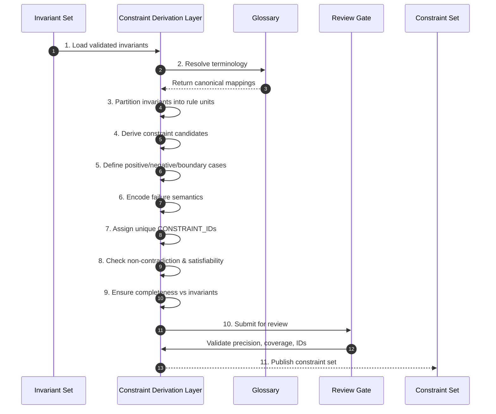

# Phase 04 — Constraint Derivation

## Overview

This phase compiles invariants into executable, uniquely identified constraints.
It is the transition from semantic truth to enforceable rules.

No constraint set that fails precision, completeness, or non-contradiction may proceed.

---

## Objective

Translate invariants into precise, addressable, executable constraints that define allowed, forbidden, and boundary behavior.

---

## Inputs

- Invariant set (Phase 02)
- Closure-validated invariants (Phase 03)
- Canonical glossary

---

## Outputs

- Constraint set with unique CONSTRAINT_IDs
- Invariant→Constraint mappings
- Positive / Negative / Boundary definitions
- Failure semantics
- Consistency report

---

## Mermaid Sequence Diagram

---

## Step Summary Table

| # | Step | What is happening |
|---:|---|---|
| 1 | Load invariants | Use closure-validated invariants as the source of truth |
| 2 | Resolve terminology | Ensure constraint language matches glossary |
| 3 | Partition invariants | Break invariants into enforceable rule units |
| 4 | Derive constraints | Convert units into executable rules |
| 5 | Define P/N/B cases | Specify allowed, forbidden, and boundary behavior |
| 6 | Encode failures | Define explicit failure conditions and responses |
| 7 | Assign IDs | Give each constraint a stable CONSTRAINT_ID |
| 8 | Check consistency | Ensure no contradictions; solution space exists |
| 9 | Ensure completeness | Every invariant is enforced by ≥1 constraint |
| 10 | Review gate | Validate precision, coverage, and traceability |
| 11 | Publish constraints | Produce authoritative constraint set |

---

## Step Sequence

### STEP 01 — Load Validated Invariants
**Tagline:** Establish authoritative semantic source

**Description:**  
Use only closure-approved invariants as inputs.

**Associated Invariants:**  
CDD_INVARIANT_PARENT_FIDELITY, CDD_CLOSURE_BEFORE_AUTHORITY

---

### STEP 02 — Resolve Terminology
**Tagline:** Maintain semantic consistency

**Description:**  
Align all constraint language with the glossary.

**Associated Invariants:**  
CDD_GLOSSARY_SHARED_REFERENCE_FRAME

---

### STEP 03 — Partition Invariants
**Tagline:** Create enforceable units

**Description:**  
Decompose invariants into atomic rule units suitable for execution.

**Associated Invariants:**  
CDD_INVARIANT_MINIMALITY, CDD_INVARIANT_NECESSITY

---

### STEP 04 — Derive Constraint Candidates
**Tagline:** Translate truth into rules

**Description:**  
Form candidate constraints that operationalize invariant meaning.

**Associated Invariants:**  
CDD_CONSTRAINT_DERIVED_FROM_INVARIANTS, CDD_CONSTRAINT_EXECUTABLE_PRECISION

---

### STEP 05 — Define Positive / Negative / Boundary Cases
**Tagline:** Bound behavior

**Description:**  
Specify allowed (positive), forbidden (negative), and edge (boundary) behaviors.

**Associated Invariants:**  
CDD_CONSTRAINT_POS_NEG_BOUNDARY

---

### STEP 06 — Encode Failure Semantics
**Tagline:** Make failure explicit

**Description:**  
Define how violations manifest and are detected.

**Associated Invariants:**  
CDD_CONSTRAINT_FAILURE_SEMANTICS

---

### STEP 07 — Assign CONSTRAINT_IDs
**Tagline:** Make rules addressable

**Description:**  
Assign stable, unique identifiers to each constraint.

**Associated Invariants:**  
CDD_CONSTRAINT_UNIQUE_IDENTITY, CDD_CONSTRAINT_ADDRESSABILITY, CDD_TRACEABILITY_STABLE_IDS

---

### STEP 08 — Check Non-Contradiction & Satisfiability
**Tagline:** Ensure a valid solution space

**Description:**  
Verify constraints do not conflict and admit at least one valid implementation.

**Associated Invariants:**  
CDD_CONSTRAINT_NON_CONTRADICTION

---

### STEP 09 — Ensure Completeness vs Invariants
**Tagline:** Enforce all truths

**Description:**  
Confirm every invariant is enforced by one or more constraints.

**Associated Invariants:**  
CDD_CONSTRAINT_COMPLETENESS

---

### STEP 10 — Review Gate
**Tagline:** Enforce precision and coverage

**Description:**  
Validate constraints for precision, coverage, IDs, and traceability.

**Associated Invariants:**  
CDD_GOVERNANCE_ENTRY_EXIT_GATES, CDD_TRACEABILITY_INVARIANT_TO_CONSTRAINT

---

### STEP 11 — Publish Constraint Set
**Tagline:** Establish executable authority

**Description:**  
Release the authoritative constraint set for test generation.

**Associated Invariants:**  
CDD_CONSTRAINT_NON_ORPHAN, CDD_FOUNDATION_CONSTRAINT_PRIMACY

---

## Exit Criteria

- All invariants are enforced by constraints  
- Each constraint has a unique, stable ID  
- Positive / negative / boundary cases defined  
- Failure semantics explicit  
- Constraint set is non-contradictory and satisfiable  
- Traceability to invariants is complete  

---

## Final Compression

This phase converts semantic truth into enforceable, addressable rules,
establishing the first executable authority in the system.
