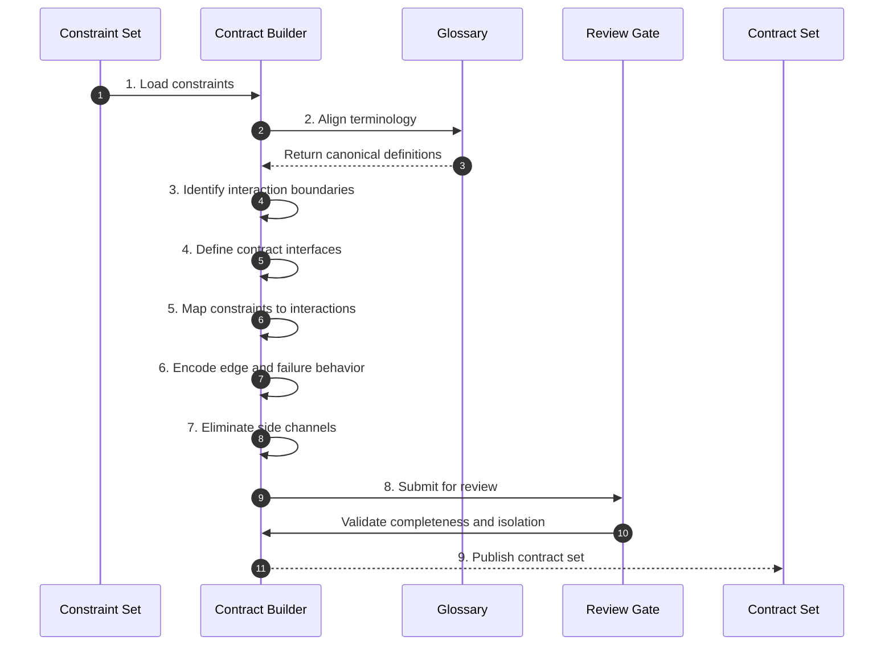

# Phase 05 — Contract & Boundary Definition

## Overview

This phase externalizes all system interactions into explicit contracts.
It defines the semantic membranes through which all components communicate.

No interaction may exist outside defined contracts.

---

## Objective

Define all system boundaries as explicit, constraint-aligned contracts that fully describe interaction behavior, dependencies, and failure modes.

---

## Inputs

- Constraint set (Phase 04)
- Canonical glossary

---

## Outputs

- Contract / interface definitions
- Boundary interaction specifications
- Failure and edge interaction rules
- Contract-to-constraint mappings

---

## Mermaid Sequence Diagram

---

## Step Summary Table

| # | Step | What is happening |
|---:|---|---|
| 1 | Load constraints | Use constraints as the interaction authority |
| 2 | Align terminology | Ensure contract language matches glossary |
| 3 | Identify boundaries | Determine all system interaction points |
| 4 | Define interfaces | Create explicit contract definitions |
| 5 | Map constraints | Ensure interactions enforce constraints |
| 6 | Encode edge/failure | Define boundary edge and failure behavior |
| 7 | Eliminate side channels | Remove hidden or implicit interactions |
| 8 | Review gate | Validate correctness and completeness |
| 9 | Publish contracts | Produce authoritative boundary definitions |

---

## Step Sequence

### STEP 01 — Load Constraints
**Tagline:** Establish interaction authority

**Description:**  
Use constraints as the governing rules for all interactions.

**Associated Invariants:**  
CDD_CONSTRAINT_DERIVED_FROM_INVARIANTS, CDD_FOUNDATION_CONSTRAINT_PRIMACY

---

### STEP 02 — Align Terminology
**Tagline:** Maintain semantic consistency

**Description:**  
Ensure all contract definitions align with glossary terms.

**Associated Invariants:**  
CDD_GLOSSARY_SHARED_REFERENCE_FRAME

---

### STEP 03 — Identify Boundaries
**Tagline:** Locate interaction surfaces

**Description:**  
Determine all points where components interact.

**Associated Invariants:**  
CDD_ARCH_BOUNDARY_FIRST

---

### STEP 04 — Define Contract Interfaces
**Tagline:** Externalize interactions

**Description:**  
Create explicit interface definitions for each boundary.

**Associated Invariants:**  
CDD_CONTRACT_BOUNDARY_EXTERNALIZATION, CDD_CONTRACT_SEMANTIC_CARRIER

---

### STEP 05 — Map Constraints to Interactions
**Tagline:** Bind behavior to boundaries

**Description:**  
Ensure all interactions enforce constraints.

**Associated Invariants:**  
CDD_CONTRACT_DEPENDENCY_EXPLICITNESS

---

### STEP 06 — Encode Edge and Failure Behavior
**Tagline:** Define boundary conditions

**Description:**  
Specify how interactions behave at edges and failure.

**Associated Invariants:**  
CDD_CONTRACT_BOUNDARY_CONDITIONS

---

### STEP 07 — Eliminate Side Channels
**Tagline:** Seal hidden behavior

**Description:**  
Ensure no interaction bypasses contracts.

**Associated Invariants:**  
CDD_CONTRACT_NO_SIDE_CHANNELS

---

### STEP 08 — Review Gate
**Tagline:** Enforce boundary integrity

**Description:**  
Validate completeness, isolation, and traceability.

**Associated Invariants:**  
CDD_GOVERNANCE_ENTRY_EXIT_GATES

---

### STEP 09 — Publish Contract Set
**Tagline:** Establish semantic membranes

**Description:**  
Produce authoritative contracts for testing and implementation.

**Associated Invariants:**  
CDD_CONTRACT_STABILITY, CDD_CONTRACT_CHANGE_PROPAGATION

---

## Exit Criteria

- All interactions defined as contracts  
- No hidden or implicit behavior  
- Contracts aligned with constraints  
- Edge and failure conditions defined  
- Ready for test generation  

---

## Final Compression

This phase defines the system’s semantic boundaries, ensuring all behavior flows through explicit, governed interaction surfaces.
