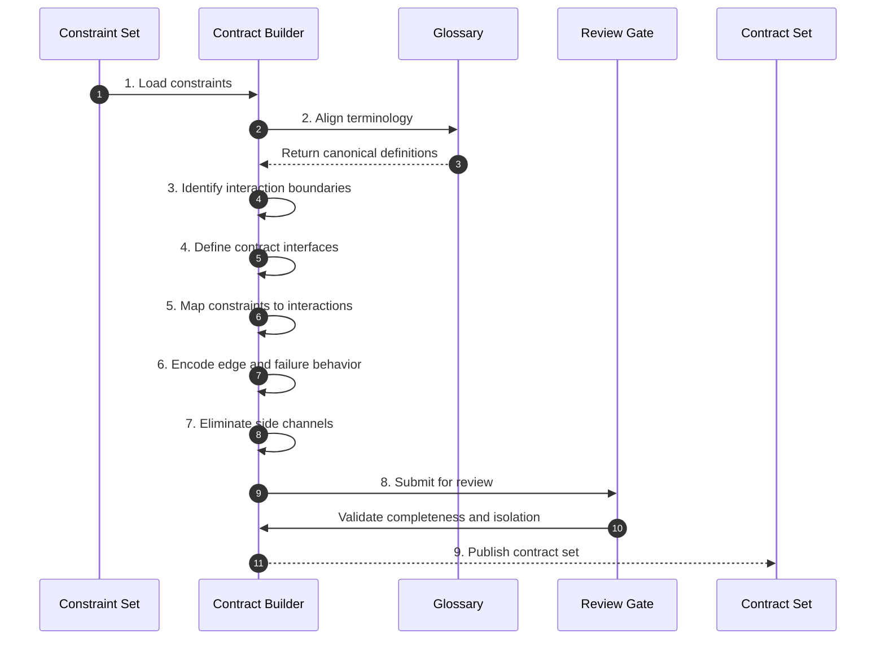

# Phase 05 — Contract & Boundary Definition

## Overview

This phase externalizes all system interactions into explicit contracts.
It defines the semantic membranes through which all components communicate.

No interaction may exist outside defined contracts.

---

## Objective

Define all system boundaries as explicit, constraint-aligned contracts that fully describe interaction behavior, dependencies, and failure modes.

---

## Inputs

- Constraint set (Phase 04)
- Canonical glossary

---

## Outputs

- Contract / interface definitions
- Boundary interaction specifications
- Failure and edge interaction rules
- Contract-to-constraint mappings

## Phase Artifacts

- [Phase 5 Invariants](./Invariants.md)

---

## Mermaid Sequence Diagram

---

## Step Summary Table

| Owner | # | Step | What is happening |
|:---:|---:|---|---|
| 🟥 | 1 | [Load constraints](./Steps/Step-01/) | Use constraints as the interaction authority |
| 🟥 | 2 | [Align terminology](./Steps/Step-02/) | Ensure contract language matches glossary |
| 🟥 | 3 | [Identify boundaries](./Steps/Step-03/) | Determine all system interaction points |
| 🟥 | 4 | [Define interfaces](./Steps/Step-04/) | Create explicit contract definitions |
| 🟥 | 5 | [Map constraints](./Steps/Step-05/) | Ensure interactions enforce constraints |
| 🟥 | 6 | [Encode edge/failure](./Steps/Step-06/) | Define boundary edge and failure behavior |
| 🟥 | 7 | [Eliminate side channels](./Steps/Step-07/) | Remove hidden or implicit interactions |
| 🟦 | 8 | [Review gate](./Steps/Step-08/) | Validate correctness and completeness |
| 🟦 | 9 | [Publish contracts](./Steps/Step-09/) | Produce authoritative boundary definitions |

---

## Step Sequence

### 🟥 [STEP 01 — Load Constraints](./Steps/Step-01/)
**Tagline:** Establish interaction authority

**Actions**

* **🟥 AI Actions:** Analyze supporting artifacts for Load Constraints, update structured outputs, and surface gaps.
* **🟦 Human Actions:** Review Load Constraints outputs, resolve domain decisions, and approve the outcome.

**Description:**  
Use constraints as the governing rules for all interactions.

**Associated Invariants:**  
CDD_CONSTRAINT_DERIVED_FROM_INVARIANTS, CDD_FOUNDATION_CONSTRAINT_PRIMACY

---

### 🟥 [STEP 02 — Align Terminology](./Steps/Step-02/)
**Tagline:** Maintain semantic consistency

**Actions**

* **🟥 AI Actions:** Analyze supporting artifacts for Align Terminology, update structured outputs, and surface gaps.
* **🟦 Human Actions:** Review Align Terminology outputs, resolve domain decisions, and approve the outcome.

**Description:**  
Ensure all contract definitions align with glossary terms.

**Associated Invariants:**  
CDD_GLOSSARY_SHARED_REFERENCE_FRAME

---

### 🟥 [STEP 03 — Identify Boundaries](./Steps/Step-03/)
**Tagline:** Locate interaction surfaces

**Actions**

* **🟥 AI Actions:** Analyze supporting artifacts for Identify Boundaries, update structured outputs, and surface gaps.
* **🟦 Human Actions:** Review Identify Boundaries outputs, resolve domain decisions, and approve the outcome.

**Description:**  
Determine all points where components interact.

**Associated Invariants:**  
CDD_ARCH_BOUNDARY_FIRST

---

### 🟥 [STEP 04 — Define Contract Interfaces](./Steps/Step-04/)
**Tagline:** Externalize interactions

**Actions**

* **🟥 AI Actions:** Analyze supporting artifacts for Define Contract Interfaces, update structured outputs, and surface gaps.
* **🟦 Human Actions:** Review Define Contract Interfaces outputs, resolve domain decisions, and approve the outcome.

**Description:**  
Create explicit interface definitions for each boundary.

**Associated Invariants:**  
CDD_CONTRACT_BOUNDARY_EXTERNALIZATION, CDD_CONTRACT_SEMANTIC_CARRIER

---

### 🟥 [STEP 05 — Map Constraints to Interactions](./Steps/Step-05/)
**Tagline:** Bind behavior to boundaries

**Actions**

* **🟥 AI Actions:** Analyze supporting artifacts for Map Constraints to Interactions, update structured outputs, and surface gaps.
* **🟦 Human Actions:** Review Map Constraints to Interactions outputs, resolve domain decisions, and approve the outcome.

**Description:**  
Ensure all interactions enforce constraints.

**Associated Invariants:**  
CDD_CONTRACT_DEPENDENCY_EXPLICITNESS

---

### 🟥 [STEP 06 — Encode Edge and Failure Behavior](./Steps/Step-06/)
**Tagline:** Define boundary conditions

**Actions**

* **🟥 AI Actions:** Analyze supporting artifacts for Encode Edge and Failure Behavior, update structured outputs, and surface gaps.
* **🟦 Human Actions:** Review Encode Edge and Failure Behavior outputs, resolve domain decisions, and approve the outcome.

**Description:**  
Specify how interactions behave at edges and failure.

**Associated Invariants:**  
CDD_CONTRACT_BOUNDARY_CONDITIONS

---

### 🟥 [STEP 07 — Eliminate Side Channels](./Steps/Step-07/)
**Tagline:** Seal hidden behavior

**Actions**

* **🟥 AI Actions:** Analyze supporting artifacts for Eliminate Side Channels, update structured outputs, and surface gaps.
* **🟦 Human Actions:** Review Eliminate Side Channels outputs, resolve domain decisions, and approve the outcome.

**Description:**  
Ensure no interaction bypasses contracts.

**Associated Invariants:**  
CDD_CONTRACT_NO_SIDE_CHANNELS

---

### 🟦 [STEP 08 — Review Gate](./Steps/Step-08/)
**Tagline:** Enforce boundary integrity

**Actions**

* **🟥 AI Actions:** Analyze supporting artifacts for Review Gate, update structured outputs, and surface gaps.
* **🟦 Human Actions:** Review Review Gate outputs, resolve domain decisions, and approve the outcome.

**Description:**  
Validate completeness, isolation, and traceability.

**Associated Invariants:**  
CDD_GOVERNANCE_ENTRY_EXIT_GATES

---

### 🟦 [STEP 09 — Publish Contract Set](./Steps/Step-09/)
**Tagline:** Establish semantic membranes

**Actions**

* **🟥 AI Actions:** Analyze supporting artifacts for Publish Contract Set, update structured outputs, and surface gaps.
* **🟦 Human Actions:** Review Publish Contract Set outputs, resolve domain decisions, and approve the outcome.

**Description:**  
Produce authoritative contracts for testing and implementation.

**Associated Invariants:**  
CDD_CONTRACT_STABILITY, CDD_CONTRACT_CHANGE_PROPAGATION

---

## Exit Criteria

- All interactions defined as contracts  
- No hidden or implicit behavior  
- Contracts aligned with constraints  
- Edge and failure conditions defined  
- Ready for test generation  

---

## Final Compression

This phase defines the system's semantic boundaries, ensuring all behavior flows through explicit, governed interaction surfaces.

