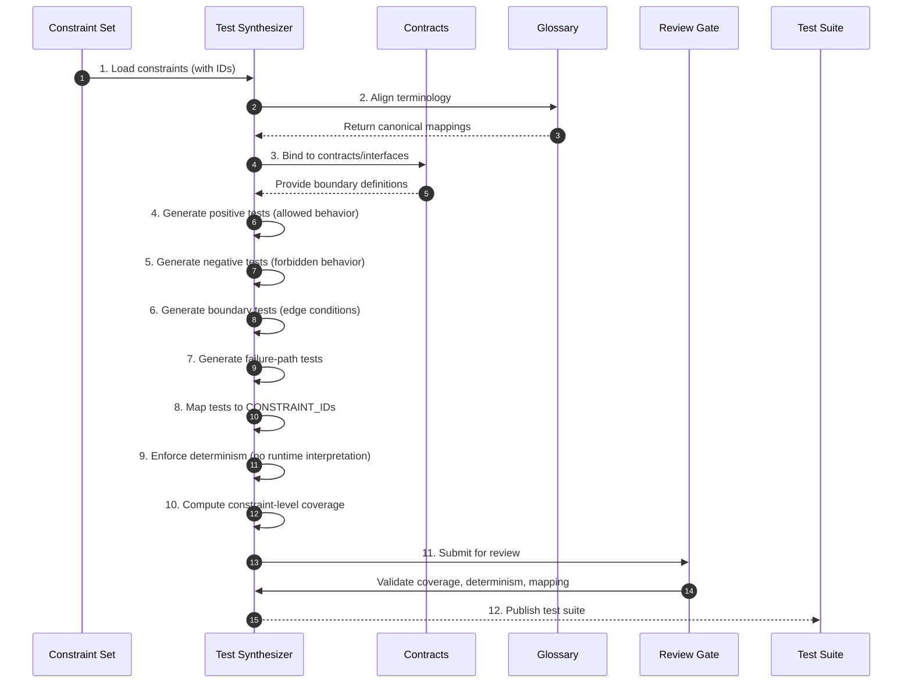

# Phase 06 — Test Generation (Proof Construction)

## Overview

This phase compiles constraints into deterministic, executable tests.
It transforms enforceable rules into mechanical proof artifacts.

No test suite that fails determinism, coverage, or traceability may proceed.

---

## Objective

Generate a complete, deterministic, and traceable test suite from constraints that proves allowed, forbidden, boundary, and failure behavior.

---

## Inputs

- Constraint set with CONSTRAINT_IDs (Phase 04)
- Contract set (Phase 05)
- Canonical glossary

---

## Outputs

- Test suite mapped to CONSTRAINT_IDs
- Positive / Negative / Boundary / Failure tests
- Deterministic execution configuration
- Coverage report (constraint-level)

## Phase Artifacts

- [Phase 6 Invariants](./Invariants.md)

---

## Mermaid Sequence Diagram

---

## Step Summary Table

| Owner | # | Step | What is happening |
|:---:|---:|---|---|
| 🟥 | 1 | [Load Constraints](./Steps/Step-01/README.md) | Use constraints as the source of truth for test generation |
| 🟥 | 2 | [Align Terminology](./Steps/Step-02/README.md) | Ensure tests use canonical glossary terms |
| 🟥 | 3 | [Bind to Contracts](./Steps/Step-03/README.md) | Anchor tests to explicit boundaries/interfaces |
| 🟥 | 4 | [Generate Positive Tests](./Steps/Step-04/README.md) | Prove required behavior is satisfied |
| 🟥 | 5 | [Generate Negative Tests](./Steps/Step-05/README.md) | Prove forbidden behavior is rejected |
| 🟥 | 6 | [Generate Boundary Tests](./Steps/Step-06/README.md) | Prove edge conditions behave correctly |
| 🟥 | 7 | [Generate Failure-Path Tests](./Steps/Step-07/README.md) | Prove explicit failure semantics |
| 🟥 | 8 | [Map Tests to CONSTRAINT_IDs](./Steps/Step-08/README.md) | Ensure each test links to CONSTRAINT_ID(s) |
| 🟥 | 9 | [Enforce Determinism](./Steps/Step-09/README.md) | Remove non-determinism and runtime interpretation |
| 🟥 | 10 | [Compute Coverage](./Steps/Step-10/README.md) | Measure semantic coverage over constraints |
| 🟦 | 11 | [Review Gate](./Steps/Step-11/README.md) | Validate completeness and integrity |
| 🟦 | 12 | [Publish Test Suite](./Steps/Step-12/README.md) | Produce authoritative proof artifacts |

---

## Step Sequence

### 🟥 [STEP 01 — Load Constraints](./Steps/Step-01/README.md)
**Tagline:** Establish proof authority

**Actions**

* **🟥 AI Actions:** Analyze supporting artifacts for Load Constraints, update structured outputs, and surface gaps.
* **🟦 Human Actions:** Review Load Constraints outputs, resolve domain decisions, and approve the outcome.

**Description:**
Use the constraint set (with IDs) as the sole source for test generation.

**Associated Invariants:**
CDD_CONSTRAINT_UNIQUE_IDENTITY, CDD_CONSTRAINT_ADDRESSABILITY

---

### 🟥 [STEP 02 — Align Terminology](./Steps/Step-02/README.md)
**Tagline:** Maintain semantic consistency

**Actions**

* **🟥 AI Actions:** Analyze supporting artifacts for Align Terminology, update structured outputs, and surface gaps.
* **🟦 Human Actions:** Review Align Terminology outputs, resolve domain decisions, and approve the outcome.

**Description:**
Ensure all generated tests use glossary-aligned terms.

**Associated Invariants:**
CDD_GLOSSARY_SHARED_REFERENCE_FRAME

---

### 🟥 [STEP 03 — Bind to Contracts](./Steps/Step-03/README.md)
**Tagline:** Anchor tests at boundaries

**Actions**

* **🟥 AI Actions:** Analyze supporting artifacts for Bind to Contracts, update structured outputs, and surface gaps.
* **🟦 Human Actions:** Review Bind to Contracts outputs, resolve domain decisions, and approve the outcome.

**Description:**
Attach tests to contract interfaces to validate interaction semantics.

**Associated Invariants:**
CDD_CONTRACT_BOUNDARY_EXTERNALIZATION, CDD_ARCH_BOUNDARY_FIRST

---

### 🟥 [STEP 04 — Generate Positive Tests](./Steps/Step-04/README.md)
**Tagline:** Prove allowed behavior

**Actions**

* **🟥 AI Actions:** Analyze supporting artifacts for Generate Positive Tests, update structured outputs, and surface gaps.
* **🟦 Human Actions:** Review Generate Positive Tests outputs, resolve domain decisions, and approve the outcome.

**Description:**
Create tests that assert required outcomes for valid inputs and states.

**Associated Invariants:**
CDD_TEST_POSITIVE_PROOF

---

### 🟥 [STEP 05 — Generate Negative Tests](./Steps/Step-05/README.md)
**Tagline:** Forbid invalid behavior

**Actions**

* **🟥 AI Actions:** Analyze supporting artifacts for Generate Negative Tests, update structured outputs, and surface gaps.
* **🟦 Human Actions:** Review Generate Negative Tests outputs, resolve domain decisions, and approve the outcome.

**Description:**
Create tests that assert rejection of invalid states and inputs.

**Associated Invariants:**
CDD_TEST_NEGATIVE_PROOF

---

### 🟥 [STEP 06 — Generate Boundary Tests](./Steps/Step-06/README.md)
**Tagline:** Validate edge conditions

**Actions**

* **🟥 AI Actions:** Analyze supporting artifacts for Generate Boundary Tests, update structured outputs, and surface gaps.
* **🟦 Human Actions:** Review Generate Boundary Tests outputs, resolve domain decisions, and approve the outcome.

**Description:**
Create tests around limits, thresholds, and transitions.

**Associated Invariants:**
CDD_TEST_BOUNDARY_PROOF

---

### 🟥 [STEP 07 — Generate Failure-Path Tests](./Steps/Step-07/README.md)
**Tagline:** Prove failure semantics

**Actions**

* **🟥 AI Actions:** Analyze supporting artifacts for Generate Failure-Path Tests, update structured outputs, and surface gaps.
* **🟦 Human Actions:** Review Generate Failure-Path Tests outputs, resolve domain decisions, and approve the outcome.

**Description:**
Create tests that assert defined failure modes and responses.

**Associated Invariants:**
CDD_TEST_FAILURE_PROOF

---

### 🟥 [STEP 08 — Map Tests to CONSTRAINT_IDs](./Steps/Step-08/README.md)
**Tagline:** Ensure traceability

**Actions**

* **🟥 AI Actions:** Analyze supporting artifacts for Map Tests to CONSTRAINT_IDs, update structured outputs, and surface gaps.
* **🟦 Human Actions:** Review Map Tests to CONSTRAINT_IDs outputs, resolve domain decisions, and approve the outcome.

**Description:**
Link each test to one or more CONSTRAINT_IDs.

**Associated Invariants:**
CDD_TEST_CONSTRAINT_MAPPING, CDD_TRACEABILITY_CONSTRAINT_TO_TEST

---

### 🟥 [STEP 09 — Enforce Determinism](./Steps/Step-09/README.md)
**Tagline:** Eliminate runtime interpretation

**Actions**

* **🟥 AI Actions:** Analyze supporting artifacts for Enforce Determinism, update structured outputs, and surface gaps.
* **🟦 Human Actions:** Review Enforce Determinism outputs, resolve domain decisions, and approve the outcome.

**Description:**
Ensure tests are stable, reproducible, and free of non-deterministic inputs.

**Associated Invariants:**
CDD_TEST_RUNTIME_DETERMINISM, CDD_DETERMINISM_REPEATABILITY

---

### 🟥 [STEP 10 — Compute Coverage](./Steps/Step-10/README.md)
**Tagline:** Measure semantic completeness

**Actions**

* **🟥 AI Actions:** Analyze supporting artifacts for Compute Coverage, update structured outputs, and surface gaps.
* **🟦 Human Actions:** Review Compute Coverage outputs, resolve domain decisions, and approve the outcome.

**Description:**
Verify all constraints are covered by at least one test.

**Associated Invariants:**
CDD_COVERAGE_CONSTRAINT_COMPLETE, CDD_COVERAGE_ID_LINKED

---

### 🟦 [STEP 11 — Review Gate](./Steps/Step-11/README.md)
**Tagline:** Enforce proof integrity

**Actions**

* **🟥 AI Actions:** Analyze supporting artifacts for Review Gate, update structured outputs, and surface gaps.
* **🟦 Human Actions:** Review Review Gate outputs, resolve domain decisions, and approve the outcome.

**Description:**
Validate mapping, coverage, determinism, and boundary anchoring.

**Associated Invariants:**
CDD_GOVERNANCE_ENTRY_EXIT_GATES

---

### 🟦 [STEP 12 — Publish Test Suite](./Steps/Step-12/README.md)
**Tagline:** Establish executable proof

**Actions**

* **🟥 AI Actions:** Analyze supporting artifacts for Publish Test Suite, update structured outputs, and surface gaps.
* **🟦 Human Actions:** Review Publish Test Suite outputs, resolve domain decisions, and approve the outcome.

**Description:**
Release the authoritative, constraint-mapped test suite.

**Associated Invariants:**
CDD_TEST_NO_ORPHANS, CDD_FOUNDATION_PROOF_BOUND_AUTHORITY

---

## Exit Criteria

- Every constraint has >=1 mapped test
- Positive, negative, boundary, and failure cases exist
- Tests are deterministic and reproducible
- Tests are bound to contracts (where applicable)
- Full traceability from CONSTRAINT_ID -> TEST

---

## Final Compression

This phase turns constraints into executable proof,
making correctness mechanically enforceable before any implementation exists.
