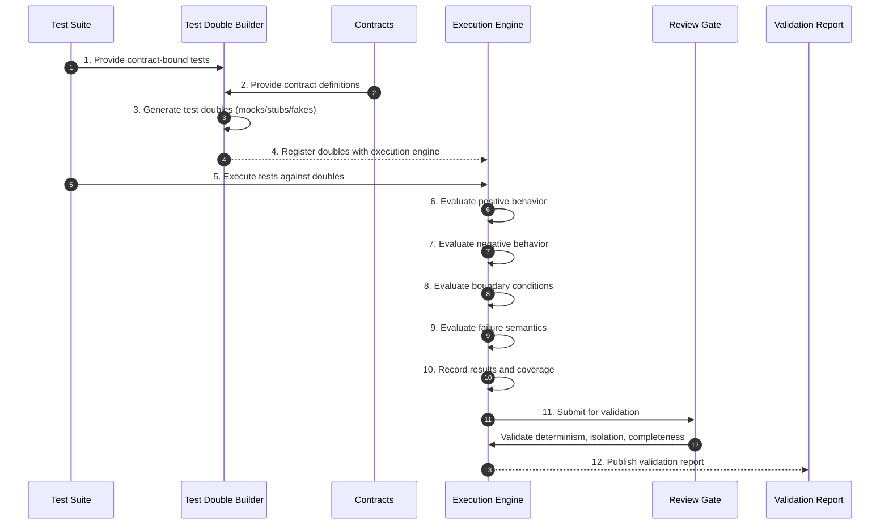

# Phase 07 — Simulation & Boundary Validation

## Overview

This phase proves the constraint-bound behavior in isolation by executing the generated test suite against contract-driven test doubles.
It establishes that the boundary model is correct before real implementation exists.

No system may proceed to implementation without passing this phase.

---

## Objective

Validate that all contract-bound interactions, edge conditions, and failure modes behave correctly under simulation, using deterministic test doubles.

---

## Inputs

- Test suite mapped to CONSTRAINT_IDs (Phase 06)
- Contract set (Phase 05)
- Constraint set (Phase 04)
- Canonical glossary

---

## Outputs

- Passing test suite against doubles
- Boundary validation report
- Interaction coverage evidence
- Failure-mode verification artifacts

## Phase Artifacts

- [Phase 7 Invariants](./Invariants.md)

---

## Mermaid Sequence Diagram

---

## Step Summary Table

| Owner | # | Step | What is happening |
|:---:|---:|---|---|
| 🟦 | 1 | [Provide Contract-Bound Tests](./Steps/Step-01/) | Use constraint-mapped tests as proof drivers |
| 🟦 | 2 | [Provide Contracts](./Steps/Step-02/) | Supply boundary definitions for doubles |
| 🟥 | 3 | [Generate Test Doubles](./Steps/Step-03/) | Create deterministic mocks/stubs/fakes |
| 🟥 | 4 | [Register Doubles](./Steps/Step-04/) | Bind doubles into execution environment |
| 🟥 | 5 | [Execute Test Suite](./Steps/Step-05/) | Run full suite against simulated boundaries |
| 🟥 | 6 | [Evaluate Positive Behavior](./Steps/Step-06/) | Confirm allowed behavior succeeds |
| 🟥 | 7 | [Evaluate Negative Behavior](./Steps/Step-07/) | Confirm forbidden behavior is rejected |
| 🟥 | 8 | [Evaluate Boundary Conditions](./Steps/Step-08/) | Validate edge conditions |
| 🟥 | 9 | [Evaluate Failure Semantics](./Steps/Step-09/) | Validate failure semantics |
| 🟥 | 10 | [Record Results & Coverage](./Steps/Step-10/) | Capture outcomes and coverage |
| 🟦 | 11 | [Review Gate](./Steps/Step-11/) | Validate isolation and determinism |
| 🟦 | 12 | [Publish Validation Report](./Steps/Step-12/) | Produce authoritative validation evidence |

---

## Step Sequence

### 🟦 [STEP 01 — Provide Contract-Bound Tests](./Steps/Step-01/)
**Tagline:** Drive proof from constraints

**Actions**

* **🟥 AI Actions:** Analyze supporting artifacts for Provide Contract-Bound Tests, update structured outputs, and surface gaps.
* **🟦 Human Actions:** Review Provide Contract-Bound Tests outputs, resolve domain decisions, and approve the outcome.

**Description:**
Use the generated test suite as the driver for simulation.

**Associated Invariants:**
CDD_TEST_DERIVED_FROM_CONSTRAINTS, CDD_TEST_CONSTRAINT_MAPPING

---

### 🟦 [STEP 02 — Provide Contracts](./Steps/Step-02/)
**Tagline:** Define boundary surfaces

**Actions**

* **🟥 AI Actions:** Analyze supporting artifacts for Provide Contracts, update structured outputs, and surface gaps.
* **🟦 Human Actions:** Review Provide Contracts outputs, resolve domain decisions, and approve the outcome.

**Description:**
Supply contract definitions that describe all interactions.

**Associated Invariants:**
CDD_CONTRACT_BOUNDARY_EXTERNALIZATION, CDD_CONTRACT_SEMANTIC_CARRIER

---

### 🟥 [STEP 03 — Generate Test Doubles](./Steps/Step-03/)
**Tagline:** Simulate reality

**Actions**

* **🟥 AI Actions:** Analyze supporting artifacts for Generate Test Doubles, update structured outputs, and surface gaps.
* **🟦 Human Actions:** Review Generate Test Doubles outputs, resolve domain decisions, and approve the outcome.

**Description:**
Create mocks, stubs, or fakes derived from contracts.

**Associated Invariants:**
CDD_DOUBLE_CONTRACT_BOUND, CDD_DOUBLE_NO_SEMANTIC_INVENTION

---

### 🟥 [STEP 04 — Register Doubles](./Steps/Step-04/)
**Tagline:** Establish execution environment

**Actions**

* **🟥 AI Actions:** Analyze supporting artifacts for Register Doubles, update structured outputs, and surface gaps.
* **🟦 Human Actions:** Review Register Doubles outputs, resolve domain decisions, and approve the outcome.

**Description:**
Bind doubles into the test execution engine.

**Associated Invariants:**
CDD_DOUBLE_BOUNDARY_ISOLATION

---

### 🟥 [STEP 05 — Execute Test Suite](./Steps/Step-05/)
**Tagline:** Run proof against simulation

**Actions**

* **🟥 AI Actions:** Analyze supporting artifacts for Execute Test Suite, update structured outputs, and surface gaps.
* **🟦 Human Actions:** Review Execute Test Suite outputs, resolve domain decisions, and approve the outcome.

**Description:**
Execute all tests against the simulated system.

**Associated Invariants:**
CDD_TEST_DETERMINISTIC_EXECUTION

---

### 🟥 [STEP 06 — Evaluate Positive Behavior](./Steps/Step-06/)
**Tagline:** Confirm allowed outcomes

**Actions**

* **🟥 AI Actions:** Analyze supporting artifacts for Evaluate Positive Behavior, update structured outputs, and surface gaps.
* **🟦 Human Actions:** Review Evaluate Positive Behavior outputs, resolve domain decisions, and approve the outcome.

**Description:**
Verify that valid behavior succeeds.

**Associated Invariants:**
CDD_TEST_POSITIVE_PROOF

---

### 🟥 [STEP 07 — Evaluate Negative Behavior](./Steps/Step-07/)
**Tagline:** Reject invalid outcomes

**Actions**

* **🟥 AI Actions:** Analyze supporting artifacts for Evaluate Negative Behavior, update structured outputs, and surface gaps.
* **🟦 Human Actions:** Review Evaluate Negative Behavior outputs, resolve domain decisions, and approve the outcome.

**Description:**
Verify that invalid behavior fails.

**Associated Invariants:**
CDD_TEST_NEGATIVE_PROOF

---

### 🟥 [STEP 08 — Evaluate Boundary Conditions](./Steps/Step-08/)
**Tagline:** Validate edges

**Actions**

* **🟥 AI Actions:** Analyze supporting artifacts for Evaluate Boundary Conditions, update structured outputs, and surface gaps.
* **🟦 Human Actions:** Review Evaluate Boundary Conditions outputs, resolve domain decisions, and approve the outcome.

**Description:**
Ensure edge cases behave correctly.

**Associated Invariants:**
CDD_TEST_BOUNDARY_PROOF

---

### 🟥 [STEP 09 — Evaluate Failure Semantics](./Steps/Step-09/)
**Tagline:** Prove failure handling

**Actions**

* **🟥 AI Actions:** Analyze supporting artifacts for Evaluate Failure Semantics, update structured outputs, and surface gaps.
* **🟦 Human Actions:** Review Evaluate Failure Semantics outputs, resolve domain decisions, and approve the outcome.

**Description:**
Ensure failures occur and are handled as defined.

**Associated Invariants:**
CDD_TEST_FAILURE_PROOF

---

### 🟥 [STEP 10 — Record Results & Coverage](./Steps/Step-10/)
**Tagline:** Capture proof evidence

**Actions**

* **🟥 AI Actions:** Analyze supporting artifacts for Record Results & Coverage, update structured outputs, and surface gaps.
* **🟦 Human Actions:** Review Record Results & Coverage outputs, resolve domain decisions, and approve the outcome.

**Description:**
Collect execution results and coverage metrics.

**Associated Invariants:**
CDD_COVERAGE_CONSTRAINT_COMPLETE, CDD_COVERAGE_ID_LINKED

---

### 🟦 [STEP 11 — Review Gate](./Steps/Step-11/)
**Tagline:** Enforce isolation and determinism

**Actions**

* **🟥 AI Actions:** Analyze supporting artifacts for Review Gate, update structured outputs, and surface gaps.
* **🟦 Human Actions:** Review Review Gate outputs, resolve domain decisions, and approve the outcome.

**Description:**
Validate that results are deterministic, isolated, and complete.

**Associated Invariants:**
CDD_GOVERNANCE_ENTRY_EXIT_GATES, CDD_DETERMINISM_REPEATABILITY

---

### 🟦 [STEP 12 — Publish Validation Report](./Steps/Step-12/)
**Tagline:** Establish boundary proof

**Actions**

* **🟥 AI Actions:** Analyze supporting artifacts for Publish Validation Report, update structured outputs, and surface gaps.
* **🟦 Human Actions:** Review Publish Validation Report outputs, resolve domain decisions, and approve the outcome.

**Description:**
Produce the authoritative validation report.

**Associated Invariants:**
CDD_FOUNDATION_PROOF_BOUND_AUTHORITY

---

## Exit Criteria

- All tests pass against test doubles
- Boundary interactions are fully validated
- No hidden or implicit behavior
- Deterministic, reproducible execution
- Full constraint coverage achieved

---

## Final Compression

This phase proves the system's behavior in isolation,
ensuring the boundary model is correct before real implementation is introduced.
