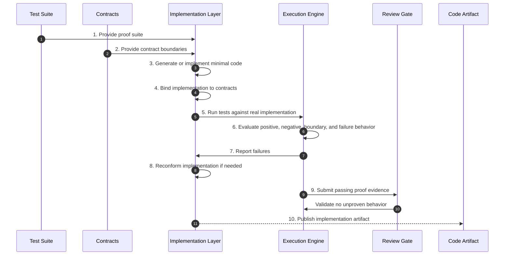

# Phase 08 — Code Generation / Implementation

## Overview

This phase realizes proven behavior as code.
Implementation is admitted only as the residual output of constraints, contracts, and passing proof.

No code may introduce behavior outside the constraint system.

---

## Objective

Generate or implement code that satisfies the proven test suite, binds to explicit contracts, and avoids unproven behavior.

---

## Inputs

- Passing simulation validation report (Phase 07)
- Test suite mapped to CONSTRAINT_IDs (Phase 06)
- Contract set (Phase 05)
- Constraint set (Phase 04)

---

## Outputs

- Implementation code
- Contract bindings
- Passing test results against real implementation
- Implementation-to-test mappings

## Phase Artifacts

- [Phase 8 Invariants](./Invariants.md)

---

## Mermaid Sequence Diagram

---

## Step Summary Table

| Owner | # | Step | What is happening |
|:---:|---:|---|---|
| 🟦 | 1 | [Provide Proof Suite](./Steps/Step-01/README.md) | Use tests as the implementation target |
| 🟦 | 2 | [Provide Contracts](./Steps/Step-02/README.md) | Bind implementation to explicit boundaries |
| 🟥 | 3 | [Generate or Implement Minimal Code](./Steps/Step-03/README.md) | Create minimal code that satisfies proof |
| 🟥 | 4 | [Bind Implementation to Contracts](./Steps/Step-04/README.md) | Connect implementation to governed interfaces |
| 🟥 | 5 | [Run Tests Against Real Implementation](./Steps/Step-05/README.md) | Execute proof suite against real implementation |
| 🟥 | 6 | [Evaluate Defined Behavior](./Steps/Step-06/README.md) | Confirm all defined behavior still holds |
| 🟥 | 7 | [Report Failures](./Steps/Step-07/README.md) | Surface any mismatch against proof |
| 🟥 | 8 | [Reconform Implementation](./Steps/Step-08/README.md) | Adjust implementation back to constraints |
| 🟦 | 9 | [Review Gate](./Steps/Step-09/README.md) | Validate authority and absence of invention |
| 🟦 | 10 | [Publish Implementation Artifact](./Steps/Step-10/README.md) | Release implementation artifact |

---

## Step Sequence

### 🟦 [STEP 01 — Provide Proof Suite](./Steps/Step-01/README.md)
**Tagline:** Establish implementation target

**Actions**

* **🟥 AI Actions:** Analyze supporting artifacts for Provide Proof Suite, update structured outputs, and surface gaps.
* **🟦 Human Actions:** Review Provide Proof Suite outputs, resolve domain decisions, and approve the outcome.

**Description:**
Use the constraint-derived test suite as the source of executable requirements.

**Associated Invariants:**
CDD_TEST_DERIVED_FROM_CONSTRAINTS, CDD_FOUNDATION_PROOF_BOUND_AUTHORITY

---

### 🟦 [STEP 02 — Provide Contracts](./Steps/Step-02/README.md)
**Tagline:** Preserve boundary authority

**Actions**

* **🟥 AI Actions:** Analyze supporting artifacts for Provide Contracts, update structured outputs, and surface gaps.
* **🟦 Human Actions:** Review Provide Contracts outputs, resolve domain decisions, and approve the outcome.

**Description:**
Supply the contract set that implementation must obey.

**Associated Invariants:**
CDD_CONTRACT_BOUNDARY_EXTERNALIZATION, CDD_CONTRACT_SEMANTIC_CARRIER

---

### 🟥 [STEP 03 — Generate or Implement Minimal Code](./Steps/Step-03/README.md)
**Tagline:** Realize only proven behavior

**Actions**

* **🟥 AI Actions:** Analyze supporting artifacts for Generate or Implement Minimal Code, update structured outputs, and surface gaps.
* **🟦 Human Actions:** Review Generate or Implement Minimal Code outputs, resolve domain decisions, and approve the outcome.

**Description:**
Create the smallest implementation that satisfies the proof suite and constraints.

**Associated Invariants:**
CDD_CODEGEN_CONSTRAINT_BOUND, CDD_CODEGEN_MINIMAL_FREEDOM

---

### 🟥 [STEP 04 — Bind Implementation to Contracts](./Steps/Step-04/README.md)
**Tagline:** Attach code to boundaries

**Actions**

* **🟥 AI Actions:** Analyze supporting artifacts for Bind Implementation to Contracts, update structured outputs, and surface gaps.
* **🟦 Human Actions:** Review Bind Implementation to Contracts outputs, resolve domain decisions, and approve the outcome.

**Description:**
Connect implementation to explicit interfaces without bypass paths.

**Associated Invariants:**
CDD_ARCH_NO_HIDDEN_COUPLING, CDD_CONTRACT_NO_SIDE_CHANNELS

---

### 🟥 [STEP 05 — Run Tests Against Real Implementation](./Steps/Step-05/README.md)
**Tagline:** Prove the real artifact

**Actions**

* **🟥 AI Actions:** Analyze supporting artifacts for Run Tests Against Real Implementation, update structured outputs, and surface gaps.
* **🟦 Human Actions:** Review Run Tests Against Real Implementation outputs, resolve domain decisions, and approve the outcome.

**Description:**
Execute the full deterministic test suite against the implementation.

**Associated Invariants:**
CDD_CODEGEN_GREEN_STATE_REQUIRED, CDD_TEST_DETERMINISTIC_EXECUTION

---

### 🟥 [STEP 06 — Evaluate Defined Behavior](./Steps/Step-06/README.md)
**Tagline:** Confirm proof preservation

**Actions**

* **🟥 AI Actions:** Analyze supporting artifacts for Evaluate Defined Behavior, update structured outputs, and surface gaps.
* **🟦 Human Actions:** Review Evaluate Defined Behavior outputs, resolve domain decisions, and approve the outcome.

**Description:**
Validate positive, negative, boundary, and failure behavior against the real artifact.

**Associated Invariants:**
CDD_TEST_POSITIVE_PROOF, CDD_TEST_NEGATIVE_PROOF, CDD_TEST_BOUNDARY_PROOF, CDD_TEST_FAILURE_PROOF

---

### 🟥 [STEP 07 — Report Failures](./Steps/Step-07/README.md)
**Tagline:** Surface non-conformance

**Actions**

* **🟥 AI Actions:** Analyze supporting artifacts for Report Failures, update structured outputs, and surface gaps.
* **🟦 Human Actions:** Review Report Failures outputs, resolve domain decisions, and approve the outcome.

**Description:**
Expose any mismatch between implementation and proof.

**Associated Invariants:**
CDD_TRACEABILITY_REVERSE_NAVIGATION

---

### 🟥 [STEP 08 — Reconform Implementation](./Steps/Step-08/README.md)
**Tagline:** Return code to proof

**Actions**

* **🟥 AI Actions:** Analyze supporting artifacts for Reconform Implementation, update structured outputs, and surface gaps.
* **🟦 Human Actions:** Review Reconform Implementation outputs, resolve domain decisions, and approve the outcome.

**Description:**
Adjust implementation until it conforms without adding unauthorized behavior.

**Associated Invariants:**
CDD_CHANGE_IMPLEMENTATION_RECONFORMANCE, CDD_CODEGEN_NO_UNPROVEN_BEHAVIOR

---

### 🟦 [STEP 09 — Review Gate](./Steps/Step-09/README.md)
**Tagline:** Enforce code authority

**Actions**

* **🟥 AI Actions:** Analyze supporting artifacts for Review Gate, update structured outputs, and surface gaps.
* **🟦 Human Actions:** Review Review Gate outputs, resolve domain decisions, and approve the outcome.

**Description:**
Validate that implementation authority comes only from passing proof.

**Associated Invariants:**
CDD_GOVERNANCE_ENTRY_EXIT_GATES, CDD_FOUNDATION_EXECUTION_AUTHORITY_EMERGENCE

---

### 🟦 [STEP 10 — Publish Implementation Artifact](./Steps/Step-10/README.md)
**Tagline:** Release residual code

**Actions**

* **🟥 AI Actions:** Analyze supporting artifacts for Publish Implementation Artifact, update structured outputs, and surface gaps.
* **🟦 Human Actions:** Review Publish Implementation Artifact outputs, resolve domain decisions, and approve the outcome.

**Description:**
Publish the implementation as the residual output of satisfied constraints and proof.

**Associated Invariants:**
CDD_FOUNDATION_CODE_AS_RESIDUE, CDD_CODEGEN_REPLACEABILITY

---

## Exit Criteria

- All tests pass against real implementation
- Code binds only through defined contracts
- No behavior exists outside the constraint system
- Implementation remains traceable to proof
- Ready for traceability verification

---

## Final Compression

This phase turns proof into implementation,
ensuring code exists only as the constrained residue of closed upstream intent.
