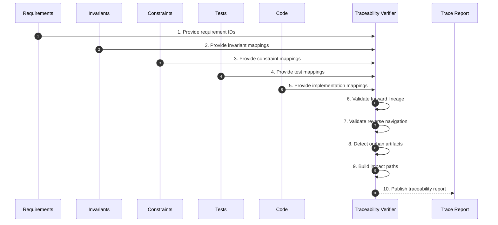

# Phase 09 — Traceability Verification

## Overview

This phase verifies complete lineage from requirement to implementation.
Every artifact must be addressable, mapped, and navigable in both directions.

No orphan artifact may proceed.

---

## Objective

Ensure each requirement, invariant, constraint, test, and code artifact can be traced through the full CDD chain.

---

## Inputs

- Requirement set (Phase 01)
- Invariant set (Phase 02)
- Constraint set (Phase 04)
- Test suite (Phase 06)
- Implementation artifact (Phase 08)

---

## Outputs

- Traceability matrix
- Orphan artifact report
- Reverse navigation map
- Impact analysis paths

## Phase Artifacts

- [Phase 9 Invariants](./Invariants.md)

---

## Mermaid Sequence Diagram

---

## Step Summary Table

| Owner | # | Step | What is happening |
|:---:|---:|---|---|
| 🟥 | 1 | [Load Requirement IDs](./Steps/Step-01/) | Load source intent identifiers |
| 🟥 | 2 | [Load Invariant Mappings](./Steps/Step-02/) | Load requirement-to-invariant mappings |
| 🟥 | 3 | [Load Constraint Mappings](./Steps/Step-03/) | Load invariant-to-constraint mappings |
| 🟥 | 4 | [Load Test Mappings](./Steps/Step-04/) | Load constraint-to-test mappings |
| 🟥 | 5 | [Load Code Mappings](./Steps/Step-05/) | Load test-to-code mappings |
| 🟥 | 6 | [Validate Forward Lineage](./Steps/Step-06/) | Confirm each layer maps downstream |
| 🟥 | 7 | [Validate Reverse Navigation](./Steps/Step-07/) | Confirm failures can trace upstream |
| 🟥 | 8 | [Detect Orphan Artifacts](./Steps/Step-08/) | Identify artifacts without lineage |
| 🟥 | 9 | [Build Impact Paths](./Steps/Step-09/) | Expose change propagation routes |
| 🟦 | 10 | [Publish Traceability Report](./Steps/Step-10/) | Produce traceability evidence |

---

## Step Sequence

### 🟥 [STEP 01 — Load Requirement IDs](./Steps/Step-01/)
**Tagline:** Establish source anchors

**Actions**

* **🟥 AI Actions:** Analyze supporting artifacts for Load Requirement IDs, update structured outputs, and surface gaps.
* **🟦 Human Actions:** Review Load Requirement IDs outputs, resolve domain decisions, and approve the outcome.

**Description:**
Load stable requirement identifiers as the origin of traceability.

**Associated Invariants:**
CDD_REQUIREMENT_ADDRESSABILITY, CDD_TRACEABILITY_STABLE_IDS

---

### 🟥 [STEP 02 — Load Invariant Mappings](./Steps/Step-02/)
**Tagline:** Trace intent into truth

**Actions**

* **🟥 AI Actions:** Analyze supporting artifacts for Load Invariant Mappings, update structured outputs, and surface gaps.
* **🟦 Human Actions:** Review Load Invariant Mappings outputs, resolve domain decisions, and approve the outcome.

**Description:**
Verify each requirement maps to one or more invariants.

**Associated Invariants:**
CDD_TRACEABILITY_REQUIREMENT_TO_INVARIANT

---

### 🟥 [STEP 03 — Load Constraint Mappings](./Steps/Step-03/)
**Tagline:** Trace truth into rules

**Actions**

* **🟥 AI Actions:** Analyze supporting artifacts for Load Constraint Mappings, update structured outputs, and surface gaps.
* **🟦 Human Actions:** Review Load Constraint Mappings outputs, resolve domain decisions, and approve the outcome.

**Description:**
Verify each invariant maps to one or more constraints.

**Associated Invariants:**
CDD_TRACEABILITY_INVARIANT_TO_CONSTRAINT

---

### 🟥 [STEP 04 — Load Test Mappings](./Steps/Step-04/)
**Tagline:** Trace rules into proof

**Actions**

* **🟥 AI Actions:** Analyze supporting artifacts for Load Test Mappings, update structured outputs, and surface gaps.
* **🟦 Human Actions:** Review Load Test Mappings outputs, resolve domain decisions, and approve the outcome.

**Description:**
Verify each constraint maps to deterministic tests.

**Associated Invariants:**
CDD_TRACEABILITY_CONSTRAINT_TO_TEST, CDD_TEST_CONSTRAINT_MAPPING

---

### 🟥 [STEP 05 — Load Code Mappings](./Steps/Step-05/)
**Tagline:** Trace proof into code

**Actions**

* **🟥 AI Actions:** Analyze supporting artifacts for Load Code Mappings, update structured outputs, and surface gaps.
* **🟦 Human Actions:** Review Load Code Mappings outputs, resolve domain decisions, and approve the outcome.

**Description:**
Verify implementation artifacts map back to tests.

**Associated Invariants:**
CDD_TRACEABILITY_TEST_TO_CODE

---

### 🟥 [STEP 06 — Validate Forward Lineage](./Steps/Step-06/)
**Tagline:** Prove downstream continuity

**Actions**

* **🟥 AI Actions:** Analyze supporting artifacts for Validate Forward Lineage, update structured outputs, and surface gaps.
* **🟦 Human Actions:** Review Validate Forward Lineage outputs, resolve domain decisions, and approve the outcome.

**Description:**
Confirm every upstream artifact is represented downstream.

**Associated Invariants:**
CDD_TRACEABILITY_END_TO_END

---

### 🟥 [STEP 07 — Validate Reverse Navigation](./Steps/Step-07/)
**Tagline:** Make failures explainable

**Actions**

* **🟥 AI Actions:** Analyze supporting artifacts for Validate Reverse Navigation, update structured outputs, and surface gaps.
* **🟦 Human Actions:** Review Validate Reverse Navigation outputs, resolve domain decisions, and approve the outcome.

**Description:**
Confirm any failure can be traced back to source intent.

**Associated Invariants:**
CDD_TRACEABILITY_REVERSE_NAVIGATION

---

### 🟥 [STEP 08 — Detect Orphan Artifacts](./Steps/Step-08/)
**Tagline:** Reject ungoverned work

**Actions**

* **🟥 AI Actions:** Analyze supporting artifacts for Detect Orphan Artifacts, update structured outputs, and surface gaps.
* **🟦 Human Actions:** Review Detect Orphan Artifacts outputs, resolve domain decisions, and approve the outcome.

**Description:**
Identify requirements, invariants, constraints, tests, or code without lineage.

**Associated Invariants:**
CDD_TRACEABILITY_NO_ORPHANS, CDD_CONSTRAINT_NON_ORPHAN, CDD_TEST_NO_ORPHANS

---

### 🟥 [STEP 09 — Build Impact Paths](./Steps/Step-09/)
**Tagline:** Expose change routes

**Actions**

* **🟥 AI Actions:** Analyze supporting artifacts for Build Impact Paths, update structured outputs, and surface gaps.
* **🟦 Human Actions:** Review Build Impact Paths outputs, resolve domain decisions, and approve the outcome.

**Description:**
Create navigation paths showing what must be revalidated when upstream meaning changes.

**Associated Invariants:**
CDD_CHANGE_DOWNSTREAM_RECOMPILATION

---

### 🟦 [STEP 10 — Publish Traceability Report](./Steps/Step-10/)
**Tagline:** Record lineage integrity

**Actions**

* **🟥 AI Actions:** Analyze supporting artifacts for Publish Traceability Report, update structured outputs, and surface gaps.
* **🟦 Human Actions:** Review Publish Traceability Report outputs, resolve domain decisions, and approve the outcome.

**Description:**
Produce the authoritative traceability evidence for governance.

**Associated Invariants:**
CDD_GOVERNANCE_EVIDENCE_REQUIRED

---

## Exit Criteria

- Full requirement-to-code traceability exists
- No orphan artifacts remain
- Stable IDs are present and navigable
- Reverse navigation works from failure to intent
- Ready for coverage and closure revalidation

---

## Final Compression

This phase proves that every behavior-bearing artifact has lineage,
so failures, changes, and proofs can always be traced back to intent.
