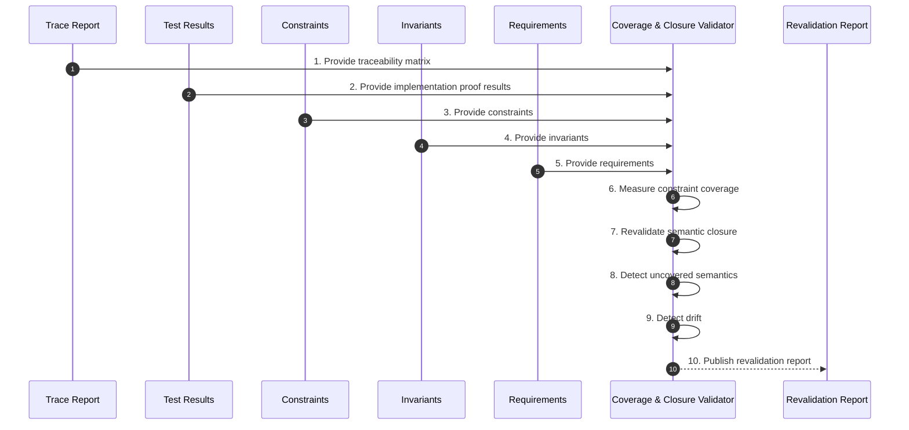

# Phase 10 — Coverage & Closure Revalidation

## Overview

This phase confirms that semantic coverage and closure still hold after implementation.
It revalidates the system as a whole rather than trusting earlier gates by inertia.

No uncovered semantic area may remain hidden.

---

## Objective

Measure constraint-level coverage, revalidate closure across all layers, and expose gaps or drift before the system is treated as complete.

---

## Inputs

- Traceability report (Phase 09)
- Test results against implementation (Phase 08)
- Constraint set (Phase 04)
- Invariant set (Phase 02)
- Requirement set (Phase 01)

---

## Outputs

- Semantic coverage report
- Closure revalidation report
- Gap and drift register
- Revalidation decision

## Phase Artifacts

- [Phase 10 Invariants](./Invariants.md)

---

## Mermaid Sequence Diagram

---

## Step Summary Table

| Owner | # | Step | What is happening |
|:---:|---:|---|---|
| 🟥 | 1 | [Load Traceability Matrix](./Steps/Step-01/) | Use lineage to scope validation |
| 🟥 | 2 | [Load Test Results](./Steps/Step-02/) | Use proof outcomes as evidence |
| 🟥 | 3 | [Load Constraints](./Steps/Step-03/) | Measure coverage against rules |
| 🟥 | 4 | [Load Invariants](./Steps/Step-04/) | Revalidate truth preservation |
| 🟥 | 5 | [Load Requirements](./Steps/Step-05/) | Revalidate source intent coverage |
| 🟥 | 6 | [Measure Constraint Coverage](./Steps/Step-06/) | Confirm constraints are proven |
| 🟥 | 7 | [Revalidate Semantic Closure](./Steps/Step-07/) | Confirm layers still contain parent meaning |
| 🟥 | 8 | [Detect Coverage Gaps](./Steps/Step-08/) | Identify uncovered semantics |
| 🟥 | 9 | [Detect Drift](./Steps/Step-09/) | Identify containment loss |
| 🟦 | 10 | [Publish Revalidation Report](./Steps/Step-10/) | Record coverage and closure status |

---

## Step Sequence

### 🟥 [STEP 01 — Load Traceability Matrix](./Steps/Step-01/)
**Tagline:** Establish validation map

**Actions**

* **🟥 AI Actions:** Analyze supporting artifacts for Load Traceability Matrix, update structured outputs, and surface gaps.
* **🟦 Human Actions:** Review Load Traceability Matrix outputs, resolve domain decisions, and approve the outcome.

**Description:**
Use traceability to identify what must be covered and revalidated.

**Associated Invariants:**
CDD_TRACEABILITY_END_TO_END

---

### 🟥 [STEP 02 — Load Test Results](./Steps/Step-02/)
**Tagline:** Gather proof evidence

**Actions**

* **🟥 AI Actions:** Analyze supporting artifacts for Load Test Results, update structured outputs, and surface gaps.
* **🟦 Human Actions:** Review Load Test Results outputs, resolve domain decisions, and approve the outcome.

**Description:**
Use implementation test results as coverage evidence.

**Associated Invariants:**
CDD_FOUNDATION_PROOF_BOUND_AUTHORITY

---

### 🟥 [STEP 03 — Load Constraints](./Steps/Step-03/)
**Tagline:** Establish coverage target

**Actions**

* **🟥 AI Actions:** Analyze supporting artifacts for Load Constraints, update structured outputs, and surface gaps.
* **🟦 Human Actions:** Review Load Constraints outputs, resolve domain decisions, and approve the outcome.

**Description:**
Use constraints as the primary coverage surface.

**Associated Invariants:**
CDD_COVERAGE_CONSTRAINT_COMPLETE

---

### 🟥 [STEP 04 — Load Invariants](./Steps/Step-04/)
**Tagline:** Establish semantic target

**Actions**

* **🟥 AI Actions:** Analyze supporting artifacts for Load Invariants, update structured outputs, and surface gaps.
* **🟦 Human Actions:** Review Load Invariants outputs, resolve domain decisions, and approve the outcome.

**Description:**
Use invariants as the semantic truth layer for revalidation.

**Associated Invariants:**
CDD_INVARIANT_PARENT_FIDELITY

---

### 🟥 [STEP 05 — Load Requirements](./Steps/Step-05/)
**Tagline:** Preserve source intent

**Actions**

* **🟥 AI Actions:** Analyze supporting artifacts for Load Requirements, update structured outputs, and surface gaps.
* **🟦 Human Actions:** Review Load Requirements outputs, resolve domain decisions, and approve the outcome.

**Description:**
Use requirements as the upstream source of meaning.

**Associated Invariants:**
CDD_REQUIREMENT_SOURCE_AUTHORITY

---

### 🟥 [STEP 06 — Measure Constraint Coverage](./Steps/Step-06/)
**Tagline:** Prove all rules

**Actions**

* **🟥 AI Actions:** Analyze supporting artifacts for Measure Constraint Coverage, update structured outputs, and surface gaps.
* **🟦 Human Actions:** Review Measure Constraint Coverage outputs, resolve domain decisions, and approve the outcome.

**Description:**
Confirm every constraint is covered by one or more deterministic tests.

**Associated Invariants:**
CDD_COVERAGE_CONSTRAINT_COMPLETE, CDD_COVERAGE_ID_LINKED

---

### 🟥 [STEP 07 — Revalidate Semantic Closure](./Steps/Step-07/)
**Tagline:** Confirm containment

**Actions**

* **🟥 AI Actions:** Analyze supporting artifacts for Revalidate Semantic Closure, update structured outputs, and surface gaps.
* **🟦 Human Actions:** Review Revalidate Semantic Closure outputs, resolve domain decisions, and approve the outcome.

**Description:**
Validate that each layer still preserves parent meaning.

**Associated Invariants:**
CDD_CLOSURE_REVALIDATION_REQUIRED, CDD_CLOSURE_PARENT_CHILD_COVERAGE

---

### 🟥 [STEP 08 — Detect Coverage Gaps](./Steps/Step-08/)
**Tagline:** Expose missing proof

**Actions**

* **🟥 AI Actions:** Analyze supporting artifacts for Detect Coverage Gaps, update structured outputs, and surface gaps.
* **🟦 Human Actions:** Review Detect Coverage Gaps outputs, resolve domain decisions, and approve the outcome.

**Description:**
Identify any semantics or constraints lacking proof.

**Associated Invariants:**
CDD_COVERAGE_GAP_VISIBILITY

---

### 🟥 [STEP 09 — Detect Drift](./Steps/Step-09/)
**Tagline:** Expose containment loss

**Actions**

* **🟥 AI Actions:** Analyze supporting artifacts for Detect Drift, update structured outputs, and surface gaps.
* **🟦 Human Actions:** Review Detect Drift outputs, resolve domain decisions, and approve the outcome.

**Description:**
Identify any loss of alignment across layers.

**Associated Invariants:**
CDD_CLOSURE_DRIFT_DEFINITION, CDD_CHANGE_DRIFT_DETECTION

---

### 🟦 [STEP 10 — Publish Revalidation Report](./Steps/Step-10/)
**Tagline:** Record system integrity

**Actions**

* **🟥 AI Actions:** Analyze supporting artifacts for Publish Revalidation Report, update structured outputs, and surface gaps.
* **🟦 Human Actions:** Review Publish Revalidation Report outputs, resolve domain decisions, and approve the outcome.

**Description:**
Produce the authoritative report for coverage, closure, gaps, and drift.

**Associated Invariants:**
CDD_GOVERNANCE_EVIDENCE_REQUIRED

---

## Exit Criteria

- All constraints are covered
- Closure is maintained across layers
- No uncovered semantic areas remain
- Drift is detected and resolved
- Ready for change governance

---

## Final Compression

This phase proves the system is still closed after implementation,
turning coverage from a code metric into semantic evidence.
