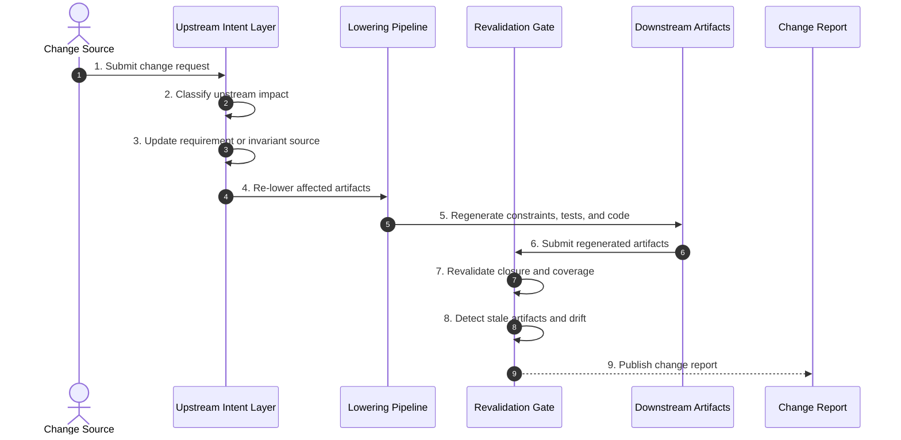

# Phase 11 — Change & Recompilation

## Overview

This phase governs system evolution by forcing change to originate upstream and propagate through re-lowering.
CDD treats patching downstream artifacts as a source of drift unless upstream intent is updated first.

No stale artifact may survive upstream change.

---

## Objective

Apply change through requirements or invariants, regenerate downstream artifacts, and revalidate closure, coverage, proof, and implementation conformance.

---

## Inputs

- Change request or updated intent
- Existing requirement, invariant, constraint, test, and code artifacts
- Traceability and coverage reports
- Canonical glossary

---

## Outputs

- Updated upstream artifacts
- Regenerated downstream artifacts
- Drift resolution report
- Revalidation evidence

---

## Mermaid Sequence Diagram

---

## Step Summary Table

| Owner | # | Step | What is happening |
|:---:|---:|---|---|
| 🟦 | 1 | Submit change | Capture requested evolution |
| 🟥 | 2 | Classify impact | Identify upstream source and affected paths |
| 🟥 | 3 | Update upstream | Change requirements or invariants first |
| 🟥 | 4 | Re-lower artifacts | Propagate through the CDD pipeline |
| 🟥 | 5 | Regenerate downstream | Recreate constraints, tests, and code |
| 🟦 | 6 | Submit artifacts | Move regenerated outputs to review |
| 🟥 | 7 | Revalidate | Confirm closure and coverage |
| 🟥 | 8 | Detect stale artifacts | Remove drift and obsolete outputs |
| 🟦 | 9 | Publish report | Record change integrity |

---

## Step Sequence

### 🟦 STEP 01 — Submit Change Request
**Tagline:** Capture evolution

**Actions**

* **🟥 AI Actions:** Analyze supporting artifacts for Submit Change Request, update structured outputs, and surface gaps.
* **🟦 Human Actions:** Review Submit Change Request outputs, resolve domain decisions, and approve the outcome.

**Description:**  
Record the desired change before altering downstream artifacts.

**Associated Invariants:**  
CDD_CHANGE_UPSTREAM_INITIATION

---

### 🟥 STEP 02 — Classify Impact
**Tagline:** Find the source layer

**Actions**

* **🟥 AI Actions:** Analyze supporting artifacts for Classify Impact, update structured outputs, and surface gaps.
* **🟦 Human Actions:** Review Classify Impact outputs, resolve domain decisions, and approve the outcome.

**Description:**  
Determine whether the change belongs in requirements, invariants, glossary, or another upstream artifact.

**Associated Invariants:**  
CDD_TRACEABILITY_REVERSE_NAVIGATION

---

### 🟥 STEP 03 — Update Upstream Source
**Tagline:** Change authority first

**Actions**

* **🟥 AI Actions:** Analyze supporting artifacts for Update Upstream Source, update structured outputs, and surface gaps.
* **🟦 Human Actions:** Review Update Upstream Source outputs, resolve domain decisions, and approve the outcome.

**Description:**  
Apply the change at the governing semantic layer.

**Associated Invariants:**  
CDD_FOUNDATION_INTENT_PRECEDENCE, CDD_CHANGE_UPSTREAM_INITIATION

---

### 🟥 STEP 04 — Re-Lower Affected Artifacts
**Tagline:** Propagate meaning

**Actions**

* **🟥 AI Actions:** Analyze supporting artifacts for Re-Lower Affected Artifacts, update structured outputs, and surface gaps.
* **🟦 Human Actions:** Review Re-Lower Affected Artifacts outputs, resolve domain decisions, and approve the outcome.

**Description:**  
Derive downstream artifacts again instead of patching them manually.

**Associated Invariants:**  
CDD_LOWERING_RECOMPILATION_OVER_PATCHING, CDD_CHANGE_DOWNSTREAM_RECOMPILATION

---

### 🟥 STEP 05 — Regenerate Constraints, Tests, and Code
**Tagline:** Refresh proof chain

**Actions**

* **🟥 AI Actions:** Analyze supporting artifacts for Regenerate Constraints, Tests, and Code, update structured outputs, and surface gaps.
* **🟦 Human Actions:** Review Regenerate Constraints, Tests, and Code outputs, resolve domain decisions, and approve the outcome.

**Description:**  
Regenerate affected executable rules, proofs, and implementation.

**Associated Invariants:**  
CDD_TEST_REGENERABILITY, CDD_CHANGE_TEST_REGENERATION

---

### 🟦 STEP 06 — Submit Regenerated Artifacts
**Tagline:** Re-enter governance

**Actions**

* **🟥 AI Actions:** Analyze supporting artifacts for Submit Regenerated Artifacts, update structured outputs, and surface gaps.
* **🟦 Human Actions:** Review Submit Regenerated Artifacts outputs, resolve domain decisions, and approve the outcome.

**Description:**  
Move regenerated outputs through review gates.

**Associated Invariants:**  
CDD_GOVERNANCE_ENTRY_EXIT_GATES

---

### 🟥 STEP 07 — Revalidate Closure and Coverage
**Tagline:** Confirm containment

**Actions**

* **🟥 AI Actions:** Analyze supporting artifacts for Revalidate Closure and Coverage, update structured outputs, and surface gaps.
* **🟦 Human Actions:** Review Revalidate Closure and Coverage outputs, resolve domain decisions, and approve the outcome.

**Description:**  
Ensure the updated system remains semantically closed and fully covered.

**Associated Invariants:**  
CDD_CLOSURE_REVALIDATION_REQUIRED, CDD_COVERAGE_REVALIDATION

---

### 🟥 STEP 08 — Detect Stale Artifacts and Drift
**Tagline:** Remove divergence

**Actions**

* **🟥 AI Actions:** Analyze supporting artifacts for Detect Stale Artifacts and Drift, update structured outputs, and surface gaps.
* **🟦 Human Actions:** Review Detect Stale Artifacts and Drift outputs, resolve domain decisions, and approve the outcome.

**Description:**  
Identify obsolete artifacts or semantic drift introduced by the change.

**Associated Invariants:**  
CDD_CHANGE_NO_SILENT_DIVERGENCE, CDD_CHANGE_DRIFT_DETECTION

---

### 🟦 STEP 09 — Publish Change Report
**Tagline:** Record evolution

**Actions**

* **🟥 AI Actions:** Analyze supporting artifacts for Publish Change Report, update structured outputs, and surface gaps.
* **🟦 Human Actions:** Review Publish Change Report outputs, resolve domain decisions, and approve the outcome.

**Description:**  
Document what changed, what was regenerated, and what evidence proves integrity.

**Associated Invariants:**  
CDD_GOVERNANCE_EVIDENCE_REQUIRED

---

## Exit Criteria

- Change originates upstream  
- Downstream artifacts are regenerated, not patched  
- Closure and coverage are revalidated  
- No stale artifacts remain  
- Drift is eliminated  

---

## Final Compression

This phase keeps evolution inside the constraint system,
ensuring change flows through authority instead of bypassing it.

