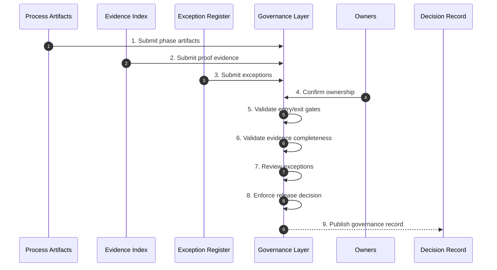

# Phase 12 — Governance & Enforcement

## Overview

This phase enforces the CDD process itself.
It prevents the pipeline from becoming ceremonial by requiring evidence, gates, ownership, and visible exceptions.

No artifact has authority without governed proof.

---

## Objective

Ensure every layer, transition, exception, and release decision is governed by explicit entry criteria, exit criteria, evidence, and ownership.

---

## Inputs

- Process artifacts from Phases 01-11
- Traceability, coverage, closure, and change reports
- Exception records
- Ownership assignments

---

## Outputs

- Governance decision record
- Exception register
- Evidence index
- Release or rejection decision

---

## Mermaid Sequence Diagram

---

## Step Summary Table

| # | Step | What is happening |
|---:|---|---|
| 1 | Submit artifacts | Gather outputs from all phases |
| 2 | Submit evidence | Gather proof and validation records |
| 3 | Submit exceptions | Make deviations visible |
| 4 | Confirm ownership | Identify responsible parties |
| 5 | Validate gates | Check entry and exit criteria |
| 6 | Validate evidence | Confirm proof exists |
| 7 | Review exceptions | Govern unresolved risks |
| 8 | Enforce decision | Approve, reject, or require rework |
| 9 | Publish record | Preserve governance outcome |

---

## Step Sequence

### STEP 01 — Submit Process Artifacts
**Tagline:** Gather governed outputs

**Description:**  
Collect the artifacts produced by each CDD phase.

**Associated Invariants:**  
CDD_GOVERNANCE_PROCESS_AUTHORITY

---

### STEP 02 — Submit Proof Evidence
**Tagline:** Require evidence

**Description:**  
Collect closure, coverage, traceability, test, and change evidence.

**Associated Invariants:**  
CDD_GOVERNANCE_EVIDENCE_REQUIRED

---

### STEP 03 — Submit Exceptions
**Tagline:** Make deviation visible

**Description:**  
Record any exception, bypass, or unresolved concern.

**Associated Invariants:**  
CDD_GOVERNANCE_EXCEPTION_VISIBILITY

---

### STEP 04 — Confirm Ownership
**Tagline:** Assign responsibility

**Description:**  
Ensure each layer and artifact has clear ownership.

**Associated Invariants:**  
CDD_GOVERNANCE_OWNERSHIP_CLARITY

---

### STEP 05 — Validate Entry and Exit Gates
**Tagline:** Enforce progression

**Description:**  
Confirm each phase met its required entry and exit criteria.

**Associated Invariants:**  
CDD_GOVERNANCE_ENTRY_EXIT_GATES

---

### STEP 06 — Validate Evidence Completeness
**Tagline:** Reject unsupported claims

**Description:**  
Confirm all correctness claims are supported by proof artifacts.

**Associated Invariants:**  
CDD_FOUNDATION_PROOF_BOUND_AUTHORITY

---

### STEP 07 — Review Exceptions
**Tagline:** Govern risk

**Description:**  
Decide whether exceptions are resolved, accepted, or blocking.

**Associated Invariants:**  
CDD_GOVERNANCE_EXCEPTION_VISIBILITY

---

### STEP 08 — Enforce Release Decision
**Tagline:** Grant or deny authority

**Description:**  
Approve, reject, or send artifacts back through the required phase.

**Associated Invariants:**  
CDD_FOUNDATION_EXECUTION_AUTHORITY_EMERGENCE, CDD_GOVERNANCE_NO_RITUALIZATION

---

### STEP 09 — Publish Governance Record
**Tagline:** Preserve accountability

**Description:**  
Record the final governance decision and supporting evidence.

**Associated Invariants:**  
CDD_GOVERNANCE_INCENTIVE_ALIGNMENT

---

## Exit Criteria

- Entry and exit gates are satisfied  
- Proof evidence is complete  
- Exceptions are visible and governed  
- Ownership is clear  
- Release or rejection decision is recorded  

---

## Final Compression

This phase ensures CDD remains enforceable rather than ceremonial,
granting authority only where evidence, ownership, and gates agree.
